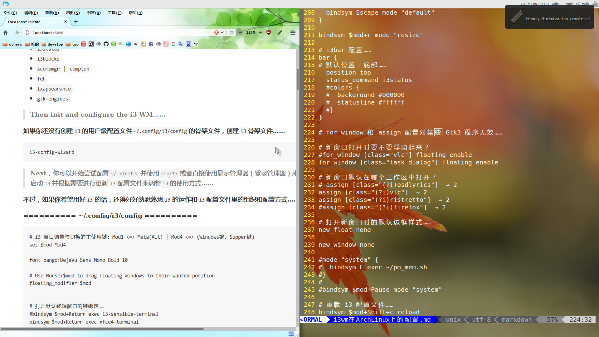
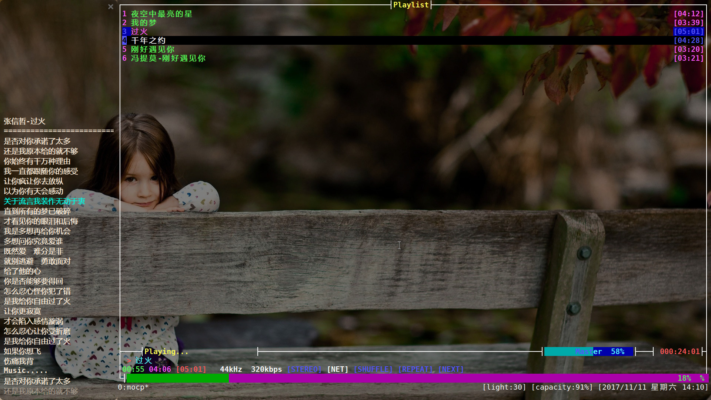
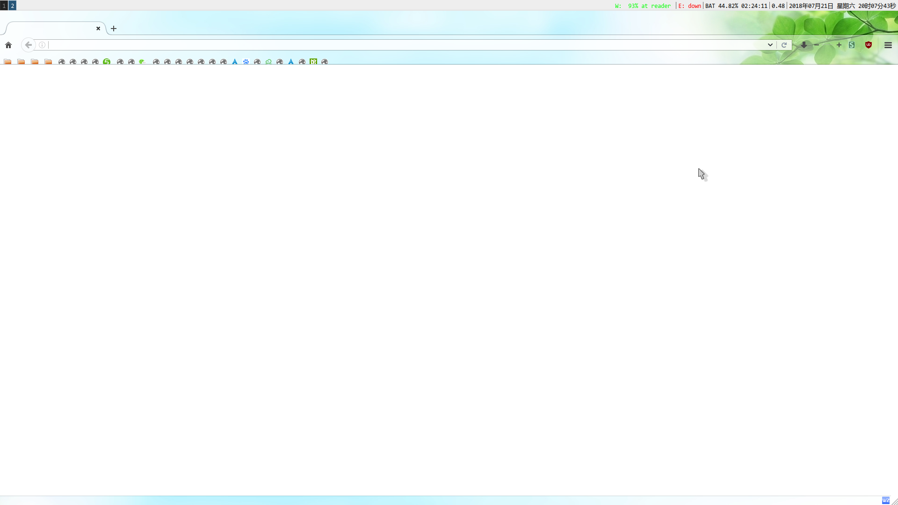

# i3：Linux 上的一个像桌面环境的窗口管理器[^wm]。

***~~&nbsp;&nbsp;如果你希望工作区内的所有窗口可以平铺[^repe]开来并能自由地在它们中进行切换和调整，也许可以尝试使用一个平铺式窗口管理器[^repe-wm]来管理它们……~~***

> 对比众多的窗口管理器，`i3`能使用`feh`设置壁纸、使用`i3bar`和`i3status`实现面板、使用`i3block`锁屏、使用`xcompmgr`或者`compton`让终端模拟器透明或者对窗口应用简单的窗口淡入淡出动画和混合阴影什么的……你甚至可以自由设置、调整、切换多工作区中的程序窗口以及自定义大多数按键组合，比如：

+ 程序窗口要还是不要标题栏？多宽？
+ 是否要对位于工作区里的程序调整窗口大小？位置？是否要最大化显示？
+ 是否要窗口堆叠显示？标签化显示？要窗口浮动起来然后又平铺、堆叠？
+ 是否要新运行的程序放到其它位置？是浮动打开还是平铺或者是堆叠？
+ 是否要在多个工作区及位于多个工作区的程序间自由切换？

## Install 

> 而实现了这些复杂的功能的同时，它又是轻量的。如果你需要这些功能，那么 First search and install i3，select install：`i3status`、`i3blocks`、`xcompmgr` 、`compton` 、 `feh`、 `lxappearance`，And Then init and configure the i3 WM…… 

## `i3` 初始化 & 配置 
&nbsp;&nbsp;如果你还没有创建`i3`的用户级配置文件`~/.config/i3/config`的骨架文件，创建`i3`骨架文件和目录…… ` mkdir -pv ~/.config/i3 && i3-config-wizard`（`i3`的用户级配置文件也可以是`~/.i3/config` ）

***&nbsp;&nbsp; Next，你便可以开始尝试配置`~/.xinitrc`并使用`startx`或者直接使用显示管理器（登录管理器）来启动`i3`并根据需要进行更新`i3`配置文件来调整`i3`的使用方式…… 不过，如果你希望用好`i3`的话，还得好好熟悉熟悉`i3`的运作和`i3`配置文件里的组织和配置方式。这是我的一份配置：  [~/.config/i3/config](.config/i3/config) 和 [~/.config/i3status/config](.config/i3status/config)***

***&nbsp;&nbsp;如果你计划使用`startx`来启动`i3`，首先配置好 [~/.xinitrc](.config/.xinitrc)…… 如果你希望在`i3`中使用其它样式的光标，首先安装它或者直接放到正确的位置，然后尝试使用`lxappearance`进行调整或者直接在 [~/.Xresources](.config/.Xresources) 中配置并在`~/.xinitrc`中使用`xrab`引入…… 。***

***&nbsp;&nbsp;如果你使用的是`startx`启动`i3`并希望在`i3`中调整默认`Gtk2`程序（比如`pcmanfm`、`thunar`……）、`Gtk3`程序(`firefox`，`RhythmCat`、`xfce4-terminal`……）的外观（比如图标，字体……），可以尝试手动更新`Gtk+`程序对应的用户级配置文件或者直接使用`lxappearance`进行调整……***

***Warning： &nbsp;&nbsp;`lxappearance`程序在调整`gtk2`程序外观时将会把`Gtk2`程序用户级配置文件之一的 `Gtk2`程序用户级配置文件：[~/.gtkrc-2.0](./.config/.gtkrc-2.0) 清空！ `Gtk3`程序读取用户级配置文件：[~/.config/gtk-3.0/settings](.config/gtk-3.0/settings.ini)；当然了，不管你希望手动调整还是直接使用`lxappearance`调整，你都需要重启`X`和`i3`后才能见到效果！ 如果你希望知道更多的`Gtk`程序配置，可以参考`Arch Linux` Wiki 的`Gtk+`条目……***

## 
> 而关于锁屏，我用的是`xtrlock`；而亮度调节，系统挂起等，直接简单粗暴地用的底层接口；声音控制，则是用的`alsamixer`……

```Bash
# 系统挂起，唤醒之后运行`xtrlock`……
sleep 1;echo mem | sudo tee /sys/power/state &>/dev/null;xtrlock &

# 调整屏幕亮度……
echo 35 | sudo tee /sys/class/backlight/intel_backlight/brightness&>/dev/null

```

&nbsp;&nbsp;如果你希望了解更多的配置细节或者希望将 i3 配置成和美美哒的桌面环境。

> 参考：

+ [xinitrc (简体中文) - ArchWiki][xinitrc]
+ [Xorg (简体中文) - ArchWiki][xorg]
+ [i3 官方指南](http://i3wm.org/docs/userguide.html)
+ Arch Linux Wiki [I3][i3] 条目……
+ on-my-i3
+ [levinit i3 config](https://github.com/levinit/i3wm-config)
+ [Archlinux下i3wm与urxvt的配置](https://www.cnblogs.com/vachester/p/5649813.html)

[i3]: https://wiki.archlinux.org/index.php/I3_(%E7%AE%80%E4%BD%93%E4%B8%AD%E6%96%87)
[xinitrc]: https://wiki.archlinux.org/index.php/Xinitrc_(%E7%AE%80%E4%BD%93%E4%B8%AD%E6%96%87)
[xorg]: https://wiki.archlinux.org/index.php/Xorg_(%E7%AE%80%E4%BD%93%E4%B8%AD%E6%96%87)

--------------------------

> 截图：



---------------



## FAQ

+ 我在 i3 中启动 firefox 时，右键上下文和菜单上下文无法显示文字[^problem][^problem2]；最后，我尝试更正了配置文件 `~/.config/gtk-3.0/settings.ini` 里关于 Font 的配置才解决这个问题。



[^wm]: 窗口管理器为所有 GUI 程序窗口提供了标题栏以及管理 OS 打开的所有 GUI 程序。（这些管理功能包括关闭、最大化、最小化、卷起、移动、切换窗口），并响应 OS 用于在多个打开的程序窗口中自由切换而定义的一组键击序列。

[^problem]: ~~虽然这个问题看起来有点可笑，但这是真的。它是由于我的配置文件里的错误配置造成的。我们知道： `i3` 仅仅是一个窗口管理器，虽然配置完成之后看起来跟桌面环境真的很像。但是，`i3` 毕竟还不是。因此，它 不能做到 `DE` 那样对所有图形库实现的 `GUI` 程序应用同一风格的`主题`，所以，如果你使用的是 `i3`，你还得根据需要，对每个版本的图形库实现的应用单独进行字体配置。而 `firefox` 是由 `GTK3+` 实现的，参见 `gtk-query-settings`.~~

[^problem2]: ~~`GTK3+` 用户级配置文件 `~/.config/gtk-3.0/settings` ，有一行 `gtk-font-name` 是用来调整所有 `GTK3+` 程序的默认字体（当然对桌面环境无效）的，但是它的取值有些奇怪，如果用引号引起， 其它的一些 `GTK3+` 程序尚还正常，但`firefox` 就会出现上面那个问题。所以，如果你的一些图形应用程序没有按照你的意愿来绘制或者是显示不正常，那么有很大的原因是因为配置文件中存在着错误。~~

[^problem3]: ~~&nbsp;&nbsp;/etc/xprofile，`~/.xprofile` 文件会被 `gdm,lightdm,lxdm` 等登录管理器读取，然而在 `~/.xprofile` 中 `export LANG="zh_CN.UTF-8"` 之后，`xfce4-terminal` 终端字体如果是 `Monospace` 时，反引号字符 \` 不能正常显示在xfce4-terminal终端上(反引号字符 \` 始终显示为单引号字符 ' ),终端字体设置成其它的字体就可以正常显示。~~


[^repe]: 所有窗口均匀分布排列在工作区中，一个紧挨着另一个，窗口之间没有缝隙，谁也不遮住谁，每个窗口均匀的占据一块地方，最大限度的利用工作区。

[^repe-wm]: 这类窗口管理器在`Linux`上有不少，比如`awsomeone`，`notion`……对比而言，`i3`是一个动态的（可平铺，可悬浮，可堆叠，默认是平铺的），搭配`feh` `i3status` `i3block`等程序一经配置完成，你就是把它叫做桌面环境也行。同时，它的配置较少，配置文件格式也挺清晰，内存占用也低……
