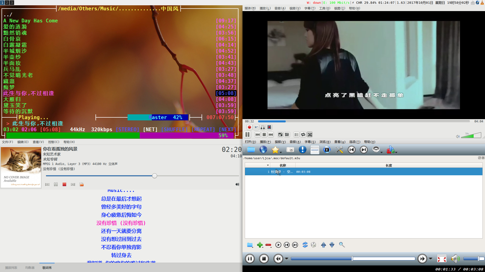

# Linux 笔记

+ [Linux 命令行艺术：管道、重定向 & shell 扩展](cli_art.md)
+ [Linux 核心控制台（tty）：](console.md)
+ [coreutils：Linux 核心工具集](coreutils.md)
+ [find与xargs：](find_xargs.md)
+ [Other FS Tools](fs_tools.md)
+ [git 笔记](git.md)
+ [grub 笔记](grub.md)
+ [iptables：Linux 服务器的包请求过滤](iptables.md)
+ [Linux和Unix](linux_unix.md)
+ [low_interface](low_interface.md)
+ [手工配置网络](network_mana.md)
+ [Other Linux Tools](other_tools.md)
+ [Power Manager：Linux 上的电源管理方案](pm.md)
+ [sed 笔记](sed.md)
+ [Shell 笔记](shell.md)
+ [Linux Shell 脚本笔记](shell_script.md)
+ [交换 Caps Lock & 左 Ctrl 键](swap_caps_ctrl.md)
+ [systemd 笔记](systemd.md)
+ [tar：Linux/Unix 归档工具](tar.md)
+ [util-linux：Linux 工具集](util_linux.md)
+ [Ext FS Tools](fs_tools/ext_fs_utils.md)
+ [一些技巧](some_tips.md)

> 参考：

+ [Linux查看硬件信息（北桥芯片组、南桥、PCI接口、CPU等） ](https://www.linuxidc.com/Linux/2014-04/99718.htm)
+ [教你如何优化Linux运行速度_Linux教程_Linux公社-Linux系统门户网站](http://www.linuxidc.com/Linux/2017-02/141138.htm)
+ [Linux上通过mail调用外部邮箱发送外部邮件 - Brad_Chen Focus on Linux. - 博客频道 - CSDN.NET](http://blog.csdn.net/brad_chen/article/details/47727295)
+ [Linux内核升级及内核编译_Linux教程_Linux公社-Linux系统门户网站](https://www.linuxidc.com/Linux/2012-08/68569.htm)
+ [top命令查看内存和多核CPU的使用 - 南城小伙的专栏 - 博客频道 - CSDN](http://blog.csdn.net/michaelfeng726/article/details/8664859)
+ [Xterm-245 完美中文支持_swordhui001_新浪博客](http://blog.sina.com.cn/s/blog_71ce334a0100mmkj.html)
+ [Linux一些经典书籍推荐_推荐各种Linux新手入门书籍](http://linuxdown.net/pdf/2016/0218/4737.html)
+ [贡献30本经典Linux学习和开发教程和资料，都是pdf完整版的 - anhuidelinger的专栏 - 博客频道 - CSDN](http://blog.csdn.net/anhuidelinger/article/details/10746613)
+ [如何成为一个真正在路上的Linuxer_Linux新闻_Linux公社-Linux系统门户网站](http://www.linuxidc.com/Linux/2014-11/109730.htm)


[cloneall]: https://github.com/bedekelly/cloneall

[arch-install-scripts]: https://git.archlinux.org/arch-install-scripts.git
[asciinema-player]: https://github.com/asciinema/asciinema-player

# 附

+ [FreeBSD 笔记](freebsd.md)
+ [Arch Linux 笔记](Arch/arch.md)
+ [CentOS 笔记](CentOS/centos.md)
+ [Ubuntu Linux 笔记](Ubuntu/ubuntu.md)
+ [OpenSUSE 笔记](opensuse.md)
+ [Gentoo Linux 笔记](Gentoo/gentoo.md)
+ [Fedora Linux 笔记](Fedora/fedora.md)
+ [LFS 笔记](Lfs/lfs.md)

## font config 基本配置：

&nbsp;&nbsp;现代 Linux 大多使用了FreeType2来渲染文字，配置文件在 /etc/fonts/fonts.conf、/etc/fonts/conf.d、`$xdg_home/.config/fontconfig/fonts.conf`、`$xdg_home/.config/fontconfig/conf.d`

> fontconfig基本配置：

+ [/etc/fonts/conf.d/99-base.conf](config/99-base.conf)
+ [/etc/fonts/conf.d/60-latain-free.conf](config/60-latain-free.conf)

----------------------

# FAQ
## 为什么在我的 Linux 虚拟控制台上，Alt Gr 键不能被用作 Meta[^meta] 键？

[^meta]: Meta 键是一个元键，一般对应于 PC 机键盘上的左 Alt，如果图形界面的伪终端也正确配置了 Alt 键，右边的 Alt 也可以作为 Meta 键使用。在没有 Alt 键的时代，是使用 Esc 键来代替 Meta 键的。

！不要担心，也许这仅仅只是因为 `Alt Gr` 键没有被映射而已。大多数的 key 在 Linux 虚拟控制台上已经正确识别和配置，不过极少数的键还是需要手动进行映射载入后才可以正常使用，以下指令在虚拟控制台上可能需要用到（在伪终端上无效）：

+ showkey 可以用来显示按键对应的映射码
+ loadkeys 可以用来从一个文件或者标准输入载入键盘映射码
+ dumpkeys 导出按键映射码

> 临时让 Alt Gr 映射到 Alt 上： `su -c 'echo -e "$(dumpkeys|grep keymaps)\nkeycode 100 = Alt" | loadkeys'`

========== dir: /usr/share/kbd/keymaps/ ========== 

```bash
echo -e "$(dumpkeys|grep keymaps)\nkeycode 100 = Alt" > alt.map
gzip alt.map
# 以根用户执行
mkdir /usr/share/kbd/keymaps/my
mv alt.map.gz /usr/share/kbd/keymaps/my
```

然后在 Linux 虚拟控制台或者已经运行了 tmux 的终端上以根用户权限执行： `loadkeys alt` 即可。

> 参考：

+ [loadkeys]() & [dumpkeys]()
+ [在虚拟终端下面使用 Emacs 不能使用右边的 Alt 键问题的解决](http://lifegoo.pluskid.org/wiki/EnableLeftCtrlInConsole.html)
+ [Linux & Unix](https://unix.stackexchange.com/questions/44453/how-to-define-a-compose-key-in-terminal-no-desktop-environment?answertab=votes)
+ [Arch Linux Wiki](https://wiki.archlinux.org/index.php/Keyboard_shortcuts)

## 为什么我的鼠标和触摸板在Linux上使用时总会出现反应延迟[^cause]的问题？

> 也许这是因为 laptopmode-tools 工具的设备自动挂起功能

&nbsp;&nbsp;如果你打开了 laptopmode-tools `AUTOSUSPEND_USE_WHITELIST=0`（laptopmode-tools 使用了黑名单[^version]）选项？可以尝试将 USB 设备的 VID 和 PID 号（！关于这个，可以尝试插拔 USB 设备并对比 lsusb 指令上下文的变化，多个设备的 vid 和 pid 使用空格分开）添加到 `AUTOSUSPEND_RUNTIME_DEVID_BLACKLIST=""` 段并重启　laptopmode-tools 服务，可能还要重新插拔一下　USB 设备。更多 laptopmode-tools 问题参见 Arch Linux laptopmode-tools Wiki.

[^cause]: 我觉得更有可能的原因是：你在打字时不小心碰到了触摸板，觉得很烦，然后打开了`在输入时（使用键盘时，包括 Alt Tab 切换窗口）禁用触摸板多长时间`这个桌面环境下的鼠标选项，同时忘记了调整……

[^version]: Note：新版本的 `laptopmode-tools` 已经将 USB 自动挂起功能从 usb-autosuspend 模块移动到运行时 pm 模块（关于它的配置文件移到了 /etc/laptop-mode/conf.d/runtime-pm.conf）。如果你希望知道 laptopmode-tools 的详细信息，请参阅 laptop-mode.conf（8）手册页。


## 如何清除 gtk 程序的最近打开历史？

&nbsp;&nbsp;`Linux`上不少有图形界面的程序在打开对话框中都存在最近打开这个选项，但是却没有提供清除最近打开的选项。不过实际上，不少`GTK`程序的实现都是类似的，它们共享最近打开历史（最近打开保存在一个`recently-used.xbel($HOME/.local/share/)` 文档中的，格式是`xml`的）。

&nbsp;&nbsp;有时候，你可能不希望在打开对话框的最近打开中存在着敏感信息或者是希望将其中一些足以泄漏隐私信息的东西清除。对此，只需要对这个文件进行操作即可对一些`GTK`程序生效。而`Qt`程序则已经提供了清除最近历史的选项。

## 如何禁用 Xfce4 DE Alt+鼠标滚轮缩放屏幕？

&nbsp;&nbsp;我使用的是 Xfce4 桌面，而且用的是触摸板，因此，很容易就会碰到 `Alt + 鼠标中键(双指滚动)`这个操作（在`Xfce4`桌面环境，这个操作被定义为缩放屏幕）,我认为我并不需要这个功能，但我找了很久，都没有找到方法来禁用或者关掉这个功能…… 后来我知道，这是由窗口管理器提供的功能。因此，如果你真的不喜欢这个功能又懒得去配置，可以尝试搭配另一个窗口管理器。

## 如何解决 Linux 声卡独占问题？

&nbsp;&nbsp;对`Linux`上这种奇葩的声卡独占问题[^softmix]一直很奇怪也没有找到解决方案，各种折腾后竟然在`ALSA`配置文件中用`pulseaudio`解决了这个问题（其实维基里面有这方面的提醒和注意）……

&nbsp;&nbsp;我听说以前的`OSS`声音驱动是可以直接启用软件混音的，然而现代的`ALSA`要启用软件混音……

&nbsp;&nbsp;如果你和我一样用的是较新的`Linux 发行`版本并且希望使用混音（就是那种多个应用程序同时使用声卡的情况）而且你的声卡有可能不支持硬件混音，可以尝试启用软件混音（详见 Arch Linux Wiki）[ALSA](https://wiki.archlinux.org/index.php/Advanced_Linux_Sound_Architecture) 部分。另一种方式则是尝试使用 pulseaudio（这种方式貌似不适合 mpd）……

&nbsp;&nbsp;如果你希望使用`ALSA`+`pulseaudio`，你也许需要先检查你的系统中是否已经安装了pulseaudio，假如没有的话你可能需要先拿起你的软件包管理器安装它，接着尝试让 ALSA 使用 pulseaudio 接管声卡：

> 配置文件(/etc/asound.conf or ~/.asoundrc)其实是在更新系统时（不知道是由`ALSA`还是`pulseaudio`创建的）是这样写的：

```config
# Use PulseAudio by default
pcm.!default {
  type pulse
  fallback "sysdefault"
  hint {
    show on
    description "Default ALSA Output (currently PulseAudio Sound Server)"
  }
}

ctl.!default {
  type pulse
  fallback "sysdefault"
}

```

而我原本的`ALSA`配置文件是这样的：

```config
defaults.pcm.card 1
defaults.pcm.device 0
defaults.ctl.card 1
```

&nbsp;&nbsp;接下来，我先用 vlc 播放了一个 MV，又用 smplayer 播放了一个视频，同时又打开了 mocp 和　RhythmCat 播放音乐，当我同时听到了它们放出的美妙声音时，心里其实挺激动的（貌似这在`Windows`上根本就不需要配置就可以直接使用的）。遗憾的是，至今仍未找到方法在 Firefox 浏览器播放在线音乐或者视频时的同时在本地播放多媒体（或者相反。据称，这可能是由于 firefox 浏览器是直接使用的 pluseaudio 来解析在线媒体流），虽然一般不会有人这样子搞……

----------------



> 参考：

+ [Linux问题解决_arch系统安装完没有声音 - FaceYe](http://www.faceye.net/search/98807.html)
+ [Advanced Linux Sound Architecture (简体中文) - ArchWiki][alsa]

[alsa]: https://wiki.archlinux.org/index.php/Advanced_Linux_Sound_Architecture_(%E7%AE%80%E4%BD%93%E4%B8%AD%E6%96%87)#.E7.94.A8.E6.88.B7.E6.9D.83.E9.99.90

[^softmix]: 虽然我由此而接触到了混音的概念，但遗憾的是：我并没有因此而学到更多（至少，混音叫做什么仍未弄清……），因为我以前是用的`Windows`，而在`Windows`上似乎不会去思考声卡独占这种`Windows`用户可能认为很奇葩的而在`Linux`上（哦，不对，一些现代 Linux 已经正确配置了声卡并启用了混音。）确实又存在的系统问题……

## 如何让显示管理器在其它的tty启动[^start]？

[^start]: 这仅适合 init 是 systemd，登录管理器使用的是 lxdm 的 Linux 系统，OpenRC，Upstart 使用了不同的方式。

[^tmp1]: &nbsp;&nbsp;除非掉了 X 服务器(后台运行 startx 似乎没有什么用)，tty1 才会重新显示出 shell 的提示符(如果确定 X 服务配置没有问题而又不希望看到那些日志信息的话，可以尝试将输出和错误信息重定向到位桶(/dev/null)，这样重新回到字符界面的时候控制台看起来也许会显得“干净”一点)。而有的时候出于需要，不想让 tty1 直接被 X 服务器占用。除了尝试传递参数给 X 服务器之外。

[^tmp]: &nbsp;&nbsp;还可以通过编辑显示管理器的服务和配置文件（假如 `init` 使用的是 `systemd` 的话。不过，init 使用的是 `System V` 的 `openRC` 的话 也可以尝试使用类似的方法配置）来让显示管理器和 X 服务器明白自己“应该”在哪一个 tty 上启动自己做到“永久性配置”。假如桌面环境显示管理器或者说是登录管理器使用的是 lxdm（其它的似乎也没有多少不同），它的 systemd 服务单元文件在不同的 Linux 发行上位置可能不同，不过实际上`/etc/systemd/system/display-manager.service` 只是一个指向显示管理器服务的符号链接，一般是在显示服务器的服务被允许开机启动或者多用户环境目标被设为图形用户时自动创建。

[^graphics]: 假如你希望登录管理器 lxdm 在系统引导时自动启动（如果系统已经直接将多用户目标配置为图形用户，那么根本不需要这样做），以根用户权限运行： `systemctl enable lxdm`。

&nbsp;&nbsp;如果你希望 systemd 在其它的 tty(比如个人计算机上很少使用的 tty12)启动显示管理器，那么通常你只需要适当的编辑登录管理器的 systemd 单元文件和登录管理器自己的配置文件（当然，还可以直接给 X 服务器传递适当的参数）：

```Bash
#sudoe是sudo -E vim的别名，目的是为了在以其它用户启动vim时仍然使用现在用户的环境比如仍然读取当前用户的vimrc。
sudoe $(readlink /etc/systemd/system/display-manager.service)  
```

```config
Conflicts=getty@tty12.service plymouth-quit.service
After=systemd-user-sessions.service getty@tty12.service plymouth-quit.service
```

以及显示管理器（我使用的 lxdm，很遗憾，我还没有找到配置 gdm 的方法）的配置文件：

============== /etc/lxdm/lxdm.conf ===============

```ini
[server]
## arg used to start xserver, not fully function
arg=/usr/bin/X -background vt12 # 这会让显示管理器在第 12 个 tty 上启动 X 服务器和自身
```

重启之后如果成功引导了系统，可以通过切换控制台或者直接用 ps 指令检查结果。 `ps aux|grep -v grep|grep X`

```log
root       790  1.7  3.0 616836 120248 tty12   Ssl+ 17:20   0:41 /usr/lib/xorg-server/Xorg -background none :0 vt12 -nolisten tcp -novtswitch -auth /var/run/lxdm/lxdm-:0.auth
```

[^tmp]: &nbsp;&nbsp;另一个问题是：在我的个人计算机上似乎并不需要这么多的 tty 在按下终端切换组合键时启动 getty 和 login（虽然在每一个 tty 上登录然后尝试在上面执行一些不同的任务或者启动多个不同的桌面环境听起来似乎比 windows 要酷多了，但实际上，这样做的也许仅仅是极少数。）

如果不想启动太多 tty 的话，可以尝试控制启动的 tty 的个数:

&nbsp;&nbsp;`Arch Linux` 维基上说，在以 `systemd` 作为 `init` 的系统上，可以编辑 `/etc/systemd/logind.conf` 配置文件的 `Login` 段，其中 `NAutoVTs` 的值就是用来控制默认的 `getty` 个数，默认有 6 个，但都是在用户按下 Ctrl+Alt Fn(1-6)时才会触发 getty 并启动一个 login。

如果将它设为 11，则会在所有 tty 上启动 getty 并将 tty1 的消息转发到 tty12。

============= /etc/systemd/logind.conf =============

```ini
[Login]
#......
NAutoVTs=1 # 启动的 tty 个数，只在 tty1 上启动了 getty
ReserveVT=2 # 哪一个 tty 可以自动启动
#……
```

## 如何在 Linux 上统一调整、应用所有 qt 程序的外观？程序主题（界面、字体、风格）？

[^tmp]: &nbsp;&nbsp;Linux 上使用 qt4 编写的应用程序看起来有点和操作系统界面字体风格不太一样(窗口风格不一样，菜单字体不一样.......)，可能对操作系统所做的字体配置并不会对 qt4 程序应用配置.

[^tmp2]: &nbsp;&nbsp;qt4 应用程序风格除了可以在程序代码中单独配置外，还可以使用 qtconfig-qt4 工具来配置从而将效果生效应用于本地所有 qt4 应用。注：仅指窗口风格与应用程序菜单字体调整。

&nbsp;&nbsp;qt4 软件包所提供的 qtconfig-qt4 用来设置了 qt 应用的风格，它将应用于本地所有的 Qt 应用程序，不过这只限于 Qt4。而 qt5 编写的应用程序已经默认遵循操作系统的风格配置，包括菜单字体风格和窗口风格，如果你启动的是桌面环境，则不需要另行手动配置。

QT4: qtconfig-qt4
QT5: qt5ct

为了使用 qt5ct 调整 QT5 程序外观： `echo 'export QT_QPA_PLATFORMTHEME="qt5ct"' >> ~/.xprofile`

+ QT_QPA_PLATFORMTHEME
+ QT_STYLE_OVERRIDE
+ QML_DISABLE_DISK_CACHE=1

> 参考：

+ Arch Wiki，[QT](https://wiki.archlinux.org/index.php/Qt#Configuration_of_Qt5_apps_under_environments_other_than_KDE_Plasma)
+ [Uniform look for Qt and GTK applications](https://wiki.archlinux.org/index.php/Uniform_look_for_Qt_and_GTK_applications)

## Linux上较轻量级浏览器Opera的简要配置

&nbsp;&nbsp;Opera 属于浏览器中的较轻量级浏览器。说是较轻量级，也只是针对 Linux PC 端的 Firefox 和 Chrome,Chromium 的内存占用而言，不过浏览器该有的功能却是有的。而且，字体渲染也不差。

&nbsp;&nbsp;Linux 中的 Opera 浏览器链接总是被添加了下划线，这样可以迅速与其它的文本相区分。

> Note：假如你觉得这有些影响视觉，可以尝试在首选项中更改，如果你没有在浏览器中的选项中找到这个选项，那么你可以尝试通过插件在样式表中重设元素样式来做到迂回更改（这种方式可能只适合 Linux PC 端）。


假如你需要使用插件来更改，那么首先你需要在浏览器扩展中获取扩展`stylish`添加一个新样式并尝试对所有链接应用样式：

```css
/* 对a标签的伪类 link 应用样式： */
a:link{text-decoration:none;}
```

```css
/* 对a标签的 hover 伪类(链接在鼠标悬停时的样子)应用样式：
并设置一个颜色以区别其它的文本。 */
a:hover{text-decoration:underline;color:red;}
```


```css
/* 还可以通过 a 标签的 visited 伪类来设置当链接点击后变成另外的样子，比如让链接访问后变成其它颜色：*/
a:visited{color:#cc00ff;}
```

> Note：尽管上面的样式设置是随意的，不过 a 标签的几个伪类在样式表中的设置时实际上是有顺序要求的，否则的话可能不会生效。关于记住它们的顺序，有前辈对此总结出了一个好记的 lvha(love hate)。

## 为什么显示管理器服务开始运行了之后就不可以停止？

## 如何在不使用桌面环境的电源管理插件下保持对核显的亮度调节？

&nbsp;&nbsp;假如没你并不希望使用桌面环境的笔记本亮度调节，而同时又希望保持对核显的亮度调节的话。

&nbsp;&nbsp;然而，即便没有安装核显的驱动包，内核也直接提供了相应的通用模块。在我的计算机上，核显使用的是`i915`模块(这可以通过`lspci -kv`来查看)。假如你同时在`/sys`文件系统下找到了由内核中的驱动提供的接口文件，那么就可以通过它直接调节核显亮度。不幸的是：这只会对会当前用户会话生效。而如果你希望对核显亮度的调节能在重启系统后同样保持，那么你可能需要在调节亮度之后将`X`服务器杀死一次才能在重新引导系统之后保持之前对核显调整好的亮度。

```log
.............
00:02.0 VGA compatible controller: Intel Corporation Broadwell-U Integrated Graphics (rev 09) (prog-if 00 [VGA controller])
	Subsystem: Acer Incorporated [ALI] Device 0940
	Flags: bus master, fast devsel, latency 0, IRQ 51
	Memory at c2000000 (64-bit, non-prefetchable) [size=16M]
	Memory at d0000000 (64-bit, prefetchable) [size=256M]
	I/O ports at 5000 [size=64]
	Expansion ROM at <unassigned> [disabled]
	Capabilities: <access denied>
	Kernel driver in use: i915
	Kernel modules: i915
............
```

```Bash
# 以根用户权限杀死 X 服务器
pkill X
```


```Bash
# 用于直接调节亮度的函数，通过直接操作由内核驱动提供的底层接口文件。虽然我知道有个 sl 的程序是用来在终端上跑火车的……
# 仅对 bash 生效……
function sl () 
{ 
  local tmp=/sys/class/backlight/intel_backlight/brightness;
  if [ -r $tmp ]; then
    if [ $# -eq 1 ]; then
      echo $1 | ${SUDO} tee $tmp > /dev/null;
    else
      echo "light:`cat $tmp`";
  fi;
  else
    echo "Intel video card driver maied not loading....";
  fi;
  unset tmp
}
```

## Linux可执行文件预编译的和自己从源代码中编译安装的有什么区别

预编译的很可能是动态编译的。动态编译允许它的某些可选依赖在它被安装之后才被安装。

## kernel: usb 1-5: string descriptor 0 read error: -22

假如您的计算机在引导`Linux`系统时真的出现了这种内核消息，那很不幸。

> ！这可能意味着：

+ 在您的计算机上，某个或者某些 USB 接口存在着硬件上的问题（比如供电不足）或者说是因为某些非人力可抗/误操作/物理等因素已经快要挂掉，从而无法被系统正常使用导致内核中的 USB 驱动模块工作不正常（无法为它分配 IO 资源（包括文件描述符等））。

+ 当然，这也有可能是其它问题所致（假如您安装了多个系统，您可以尝试在其它系统（比如`Windows`）上测试测试您的那些`USB`接口是否工作正常）。

> Tip：

如果您认为是内核的问题，那么您可以尝试在插拔`USB`设备时跟踪一下系统日志：

```Bash
# 如果您计算机上的 Linux 使用的 init 是 systemd：
journalctl -f
```

>！要不然，您就很有可能需要尝试对那个或者那些“不正常的”`USB`接口进行检测和维修，假如您拥有不俗的硬件造诣的话。

# 参考：

+ [Compiling APR for UNIX - The Apache Portable Runtime Project](http://apr.apache.org/compiling_unix.html)
+ [gcc4](http://www.myexception.cn/linux-unix/1604271_3.html)
+ [Install Mono on Linux  Mono](https://github.com/mono/mono)
+ [TFTP协议详解 - 技术文档 - 网络技术 Linux时代 - 开源、自由、共享 - 中国最大的Linux技术社区](http://linux.chinaunix.net/techdoc/net/2009/05/04/1109928.shtml)

