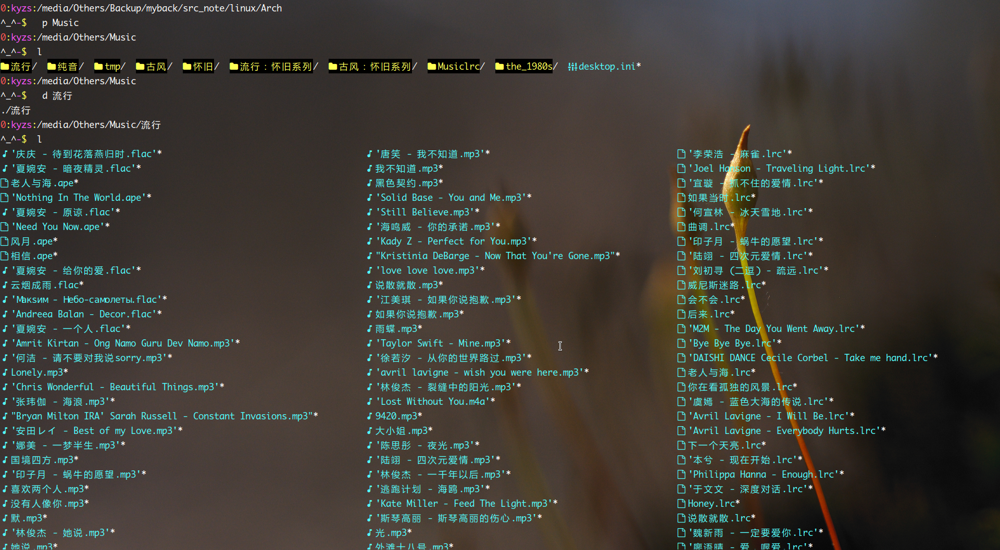

<link href="../css/style.css" rel="stylesheet" type="text/css" />

# Some Applications[^app]

[^app]: 以下软件在 Arch Linux 经测试可用，在其它 Linux 发行版应该也可以。


- [compiz](app/compiz.md)
- [i3wm：Linux 上的一个像桌面环境的窗口管理器。](app/i3.md)
- [vim安装与配置笔记](app/vim.md)

<div class="dir">

## 终端模拟器

- [ruxvt](app/ruxvt.md)
- [terminator](#)
- [tilda](#)
- [guake](#)
- [Coolterm](#)
- [fbterm：Linux 上，一个不需要 X 就能显示、输入中文的伪终端模拟器。](app/fbterm.md)

</div>

> cd 的代替、辅助工具

<div class="">

- [zoxide](#)[^zoxide]
- [autojump](#)[^autojump]

</div>

[^zoxide]:  bash init: `zoxide init bash >> ~/.bashrc`; `zoxide query -l`; z: 根据权重直接进入某个曾 cd 过的目录;  zi: 选择一个 cd 或者 zoxide add 过的目录进行切换;
[^autojump]:  bash init: `echo 'source /usr/share/autojump/autojump.bash' >> ~/.bashrc`; j dir ;跳转到某个 cd 过的目录;

> Terminal File Browser：ls 的进一步实现

<div class="pages">

+ [sebastiencs/icons-in-terminal](https://github.com/sebastiencs/icons-in-terminal#installation)
+ [sebastiencs/ls-icons\[^ls-icons\]](https://github.com/sebastiencs/ls-icons)
+ [lsd](#)
+ [ranger](#)
+ [exa](#)
+ [clifm](https://github.com/leo-arch/clifm/wiki/Advanced#archives)
- [mc](app/mc.md)

</div>




[^ls-iocns]: ls-icons 项目支持在终端模拟器上使用 ls 时在目录或者文件前显示一个图标。请注意：此 ls 并非系统中的 ls。

> Terminal File Searcher

+ [fzf](https://github.com/leo-arch/clifm/wiki/Advanced#archives)
+ [fd](https://github.com/leo-arch/clifm/wiki/Advanced#archives)

## Media Player

<div class="dir">

- [mocp：Linux 上的一个轻量级命令行本地音乐播放器。](app/mocp.md)
- [rhythmcat: ](app/rhythmcat.md)
- [cmus(C Music Player) Install & Configure ](app/cmus.md)
- [mplayer](app/mplayer.md)
- [Listen1_Desktop app：一个更好的网络音乐播放器实现](https://github.com/listen1/listen1_desktop)

</div>

## Documents Software

> Markdown

<div class="dir">

- [vnote](app/vnote.md)
- [typora](#)
- [pandoc 使用笔记](app/pandoc.md)
- [gitbook](app/gitbook.md)
- [mdbook: 与 gitbook 功能相似的一个笔记编译工具。但功能较少。](#)
- [wkhtmltopdf：html -> pdf](https://linux.cn/article-8362-1.html)

</div>

## Others app

<div class="pages">

- [压缩包环回挂载：archivemount](http://mirrors.xmu.edu.cn/gentoo/distfiles/74/archivemount-0.9.1.tar.gz)
- [Linux 图片工具](app/pic_utils.md)
- [oneko<sup>aur</sup>：追逐光标的精灵。](#)
- [lolcat](#)
- [cowsay](#)
- [pv](#)

</div>


<!--

移动窗口需要按住Alt，那么调整窗口大小要按住什么？为什么连调个窗口大小都如此困难？

为什么最大化窗口之后中间的那内容部分怎么不跟着一起变化？

为什么播放有些个本地音乐还得有网络连接才行？

为什么有些格式的音频播放不了？

为什么缓存与下载路径无法更改？

-->

<link href="../../css/style.css" rel="stylesheet" type="text/css" />

> vnote

参考：

- VNote界面自定义字体大小 [issue#1214][#1214]
- VNote 阅读界面不显示

<div class="pages">

+ [issue#853][#853]
+ [issue#1483][#1483]
+ [issue#2104][#2104]

</div>

[#853]: https://github.com/vnotex/vnote/issues/853
[#1214]: https://github.com/vnotex/vnote/issues/1214
[#1483]: https://github.com/vnotex/vnote/issues/1483
[#2104]: https://github.com/vnotex/vnote/issues/2104

- [rhythmcat](https://github.com/lazymonkey/rhythmcat)

<details>

<summary>..... </summary>

> 依赖：

+ gstreamer0.10:
+ gstreamer0.10-bad:
+ gst-plugins-bad-0.10.23
+ gstreamer0.10-bad-plugins
+ gstreamer0.10-base:
+ gstreamer0.10-ffmpeg:
+ gstreamer0.10-good:
+ gstreamer0.10-good-plugins
+ gstreamer0.10-ugly:
+ gstreamer0.10-ugly-plugins-0.10.19


```log
编译失败的gstremer0.10-good

In file included from /usr/include/glib-2.0/glib/gthread.h:32,
                 from /usr/include/glib-2.0/glib/gasyncqueue.h:32,
                 from /usr/include/glib-2.0/glib.h:32,
                 from /usr/include/gstreamer-0.10/gst/gst.h:27,
                 from gsttaglibmux.h:24,
                 from gstid3v2mux.h:24,
                 from gstid3v2mux.cc:51:
gstid3v2mux.cc: 在函数‘GType gst_id3v2_mux_get_type()’中:
/usr/include/glib-2.0/glib/gatomic.h:113:19: 错误：argument 2 of ‘__atomic_load’ must not be a pointer to a ‘volatile’ type
  113 |     __atomic_load (gapg_temp_atomic, &gapg_temp_newval, __ATOMIC_SEQ_CST); \
```


</details>
