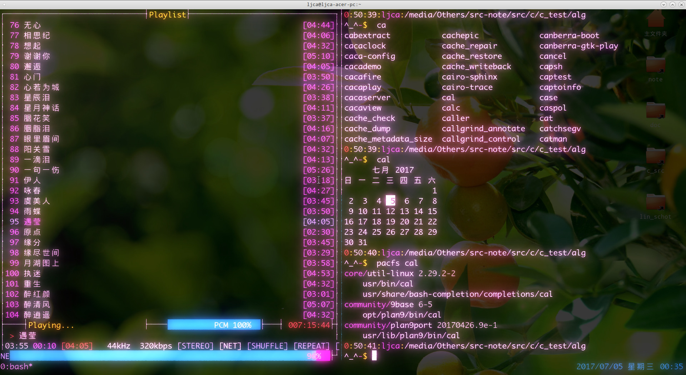

<link href="../../css/style.css" rel="stylesheet" type="text/css" />

#  fbterm：Linux 上，一个不需要 X 就能显示、输入中文的伪终端模拟器[^tty]。

----------------------------------------------


> 如果你希望使用[fbterm](http://fbterm.googlecode.com/files) [^1] 并打算动手编译安装到系统中……

如果你使用的是`Arch Linux`，可以直接从`aur`[^aur-fbterm]上一键构建安装到系统中。而在某些系统中，可以直接从源中安装。

下面是手动编译的简要步骤：

> if: fbterm <= 1.7，依赖及可能的条件: 

 + 必须依赖:freetype2 fontconfig
 + 可选依赖 libx86(vesa) gpm(mouse support)
 + `gcc <= 5.4` [^gcc]

我的系统中存在多个不同版本的编译器（一些是在架构相似的系统上构建的），在手动编译时通过 configure 脚本从命令行上传递变量给 make 来告诉 make 在编译时到底使用系统中的哪一个编译器来作为实际编译。允许传递的变量和所有的选项可以通过源码包下的 ./configure --help 来得到：

+ --enable-FEATURE[=ARG]  include FEATURE [ARG=yes] .......
+ --disable-gpm           disable gpm mouse support [[default=auto]]  是否禁用控制台鼠标功能支持，默认会自动检测，如果已经安装了 gpm 就启用否则就不启用。如果不需要，显式禁用(--disable-gpm=yes)
+ --disable-vesa          disable VESA video card support [[default=auto]] 是否禁用 vesa 支持

> 一些对 make 有效的环境变量:

+ CXX         C++ compiler command  # 指定 c++ 编译器的位置
+ CXXFLAGS    C++ compiler flags # 指定 c++ 编译器编译标志，比如头文件和库的路径
+ LDFLAGS     linker flags, e.g. -L<lib dir> if you have libraries in a anonstandard directory <lib dir>
+ LIBS        libraries to pass to the linker, e.g. -l<library>
+ CPPFLAGS    (Objective) C/C++ preprocessor flags, e.g. -I<include dir> If you have headers in a nonstandard directory <include dir>
+ CC          C compiler command  # 指定 C 编译器的位置
+ CFLAGS      C compiler flags # 指定 c 编译器编译标志，比如头文件和库的路径
+ PKG_CONFIG  path to pkg-config utility
+ .........

在我的`Arch Linux`系统上，gcc 版本已是 >= 6.1，因此很自然的，编译 fbterm 1.7 没有成功。

我尝试在编译过程指定了在其它系统上已经编译好的编译器，版本稍旧(如果是在 Arch Linux 上，你可以到它的存档库里下载旧版本的 gcc 及其依赖包然后尝试将 gcc 降级（或者直接搜索`gcc`安装`gcc-5`使用它） 1~2 个版本( < 6.1 >= 4.9)后再编译，但这种方式并不推荐，因为如果你没有在编译完成后及时恢复 gcc 的版本到原来的版本，那些依赖于特定编译器库的应用可能都无法启动而导致整个系统都无法启动……)。

```Bash
tmp=/usr/local/tmp-tools/gcc-4.9.2/bin CC=$tmp/gcc CXX=$tmp/g++ \
./configure && make -j5 && sudo make install 
```

##  配置 fbterm

 默认安装好未做任何配置的 fbterm 直接用普通用户运行可能会失败(虽然可以使用根用户来运行，但这并不推荐)，fbterm 已经提供了解决方案并对其做出了解释：

+ fbterm 在运行时需要临时具有根用户的权限来存取内核（据称这是为了映射某些键），给 fbterm 设置 uid 位也许是最合适的方法，就像 passwd 程序一样。不然以普通用户运行的 fbterm 会收到一个 can't change kernel keymap.....一样的消息，这时你也许会发现 fbterm 的某些快捷键也用不上（比如新建终端窗口的 Ctrl+Meta+C 和切换终端窗口的 Shift ←，Shift →)。

```Bash
#  普通用户需要加入 video 组才能有打开 fbdev 的权限。
gpasswd -a $USER video
# fbterm 设置键盘映射时需要临时具有存取内核的权限。
chmod u+s $(which fbterm)
sudo setcap 'cap_sys_tty_config+ep' /usr/bin/fbterm
```

+ 如果是编译的话，fbterm 的 terminfo 文件可能也要放到合适的位置(比如 /usr/share/terminfo/f/ $HOME/.terminfo/f/ )下。

```Bash
# fbterm 的 terminfo 文件 fbterm 需要放到合适的位置。不然在 fbterm 下，某些需要 fbterm 的 terminfo 信息的应用可能不会正常工作……
# 如果你在系统中没有找到 fbterm 的 terminfo 文件，那可以尝试手动编译它：
# 首先进入 fbterm 源码下的 terminfo 目录中：
# 除非以根用户执行，否则 tic 会将编译出来的 terminfo 文件放到用户级目录中($HOME/.terminfo/f/)，如果要编译的 terminfo 文件已经存在了将会导致 tic 命令执行失败。
tic fbterm
```

---------------------------------
##  fbterm 运行时配置及基本快捷键
可以通过传递参数给 fbterm 或者在配置文件中定义选项来更改它的行为。注：配置文件不是 shell 脚本，shell 指令无效。

============  ~/.fbtermrc ===========

```ini
font-names=DejaVu\ Sans\ Mono\ for\ Powerline:Style=Bold
font-size=19
......
color-foreground=7
color-background=0
text-encodings=UTF-8
cursor-shape=1 # fbterm 光标形状
cursor-interval=0 # fbterm 光标闪烁时差，0 即为不闪烁
input-method=fcitx-fbterm # fbterm 输入法
.....
```

### 基本快捷键列表
+ Ctrl+Meta+C 新建一个窗口
+ Shift <- 或者 Shfit -> 在窗口之间切换
+ ……

-----------------------

+ 如果你觉得在 fbterm 上使用背景图片能增加一些点缀的话，那就给 fbterm 设置背景图片。不过在使用背景图片之前，你可能需要先安装 fbv。

+ 假如你希望每次启动 fbterm 时使用不同的背景图片，那么可以尝试将背景图片的路径以位置参数的形式传递给 fbv），如果写成了 shell 脚本又没有设置 fbterm 在登录 tty 时自动启动的话。如果 X 用的少，shell 又是 Bash，那么可以选择在登录 tty 时自动进入 fbterm，如果你希望如此的话。

> fbterm & tmux.


下面的技巧来源于 wiki：

==============  ~/.bashrc ===============
```cfg
[ "$TERM" = "linux" ] && echo -en "\e]P7ffffff"
if [[ `tty` = \/dev\/tty[1-6]  ]] && type fbterm &> /dev/null;then 
  tmp=/home/external
  echo -en "\e[?25l" #hide cursor
  fbv -ciuker "$tmp/usr/share/backgrounds/fbterm.jpg" << EOF
q
EOF
  shift
  unset tmp
  export FBTERM_BACKGROUND_IMAGE=1
  LANG="zh_CN.UTF-8" fbterm
fi
```

##  `fbterm`中文输入法: `fcitx-fbterm？` `yong？`[^yong] `ibus-fbterm？`
 如果你希望在 fbterm 上输入中文，那么安装一个 fbterm 中文输入法并激活它就是必要的。

<div class="p">

因为我使用的中文输入法框架是`fcitx`，然而据说基于`fcitx`框架的 [fcitx-fbterm](https://github.com/fcitx/fcitx-fbterm) 已经停止开发了，但实际上它还能在 [git](https://github.com/fcitx/fcitx-fbterm) 或者 [fcitx-fbterm][fcitx-fbterm] 找到。如果你用的是 Arch Linux，还可以从 AUR 上找到。另外，部分 Linux 发行系统源中也还没有移除这个软件包。

</div>

> Install

fcitx-fbterm 是用 cmake 来配置的。最简单的安装方法可以从 INSTALL 文档取得。安装它，首先从 git 上获取源码并进入源码目录，开发者推荐在单独的目录中进行编译：

```Bash
mkdir build;cd build
cmake .. && make && sudo make install
```

### fcitx-fbterm 用法

<div class="p">

如果你已经运行桌面环境并且 fcitx 在桌面环境自动启动的条目中，那可以直接通过 Ctrl Space（这可以在 fcitx 配置中更改)切换(如果不能运行，可以先尝试执行一遍 fcitx-fbterm-helper 脚本)了。
 
如果你不打算运行 X 或者是没有安装 X ，可能需要在启动 fcitx 之前检查系统是否已经启动了 dbus。如果没有启动则可以尝试使用 dbus-launch 来启动。否则可以尝试后台启动 fcitx 后使用 Ctrl Space 进行切换。

</div>
 
```Bash
# 启动 dbus-daemon 
eval "dbus-launch --auto-syntax"

# 屏蔽输出与错误消息并在后台运行 fcitx
LANG="zh_CN.UTF-8" fcitx &>/dev/null & 
```

你也许会希望在那上面播放多媒体，迄今为止，已经有很多种 `ncurses` 版本的音乐播放器实现（比如 mocp, cmus, xmms 等），你甚至可以在那上面播放视频（这在我看来，真的一点都不酷，甚至有点 low），但是说真的：我的确见过有人这样做……

# 附

##  terminfo

+ tic：编译 terminfo 文件为数据格式，默认会保存到 ~/.terminfo/[x]/ 下.

```Bash
pushd fbterm-1.7/terminfo
tic fbterm
```

+ infocmp：查看 terminfo 数据库的可读信息
```Bash
# infocmp [terminfofile]
infocmp fbterm
infocmp
```

## 其它终端：

+ [Google Code Archive - Long-term storage for Google Code Project Hosting][src]
+ [Floby-TermKit](https://github.com/Floby/TermKit)
+ [TermKit](https://github.com/unconed/TermKit)
+ [stjerm](https://github.com/stjerm/stjerm)




[fcitx-fbterm]: https://github.com/felixonmars/aur3-mirror/tree/master/fcitx-fbterm.git
[src]: https://code.google.com/archive/p/fbterm/

> 参考：

+ [fbcon](https://www.kernel.org/doc/Documentation/fb/fbcon.txt)
+ [Fbterm (简体中文) - ArchWiki][fbterm]
+ [archlinux编译内核解决console下中文显示问题](http://80x86.io/post/recomplie-linux-kernel-solve-chinses-words-display-bug-under-console)
+ [在Linux终端机上，显示中文等多种UTF-8文字](https://tomli.blog/archives/2012/07/1430.html)
+ [IBus (简体中文) - ArchWiki][ibus]
+ Yong

[fbterm]: https://wiki.archlinux.org/index.php/Fbterm_(%E7%AE%80%E4%BD%93%E4%B8%AD%E6%96%87)
[ibus]: https://wiki.archlinux.org/index.php/IBus_(%E7%AE%80%E4%BD%93%E4%B8%AD%E6%96%87)

ljca&copy; 2017-？

[^tty]: 实际上，早就有人通过重新编译打过补丁的内核直接在纯 tty 上完全显示中文等多字节编码的做法。

    也许你会奇怪`Linux`上那些像`gnome-terminal`一样的终端软件为什么会被称之为终端模拟器？实际上，我也很希望知道这个问题的答案。而伪终端这种叫法来源于那些古老的 Unix 和 Linux 参考书籍（如果你希望了解更多，可以尝试在 Unix 及终端的诞生和发展史中去找找），他们都是这样称呼它的。对此，他们的解释是：真正的核心终端实际上都对应着一个物理设备文件，而终端模拟器没有与之对应的物理设备文件，因此，它还有另外一个称呼，那就是伪终端 PTY…… 。不幸的是：fbterm 似乎停止了维护和更新。

[^fbterm]: `fbterm`和`jfbterm`运行在核心控制台的`FrameBuffer`（这样描述也许不对），是一种 shell 程序（类似于图形界面下的终端模拟器），依靠 `freetype` 和 `fontconfig` 来提供基本的字体渲染，不需要 X 服务也可以支持基本的中文显示。当然了，fbterm 的功能不仅仅只有这点：如果你打算使用它并希望能获得`GUI`下终端模拟器般的体验，那还要尝试对`fbterm`终端的字体等进行调整和配置并搭配`tmux`。不仅如此，如果您需要的话，还可以在上面进行播放多媒体、输入中文、浏览网页等工作…… 遗憾的是：控制台版本的网络浏览器功能并不完善（它们甚至不支持图片显示），而且 Arch Linux 的官方源中已经不再包含它们了(可能是因为开发已经停止或者开发进度滞后了，这个项目貌似已经从 [google code](https://code.google.com/archive/p/fbterm) 上移除了），因此要使用它们只能选择从 AUR 上或者从其它地方获取源码后手动编译。

[^jfbterm]: [jfbterm](https://) 据称是日本人发明的，和 fbterm 是一类东西，不过无论是从 AUR 上构建安装还是使用起来都存在着问题（一个因为依赖而从网站上下载的内核包可能会通不过 gpg 检查导致 jfbterm 编译无法开始，而实际只用到了其中的部分代码)……

[^aur-fbterm]: 我发现`AUR`上的 [fbterm-git](https://aur.archlinux.org/fbterm-git) 在运行时有一点小情况：它会让 Linux Console 在运行了 fbterm 之后就会进行某些环境的自动配置，比如设定终端类型(即设置 TERM 变量)为 fbterm(理论上 fbterm 已经支持 256 色，而 Linux Console 则声称自己仅支持 16 色，但这并不是我想要的结果或者说是那些基于 ncurses 库的伪图形界面程序(比如 mocp 和 alsamixer 以及 mc，偏偏它们又是我所喜欢的几个程序)不希望的，它们都非常依赖于终端类型的设定，在没有 X 环境时它们通常希望终端类型是 linux，如果终端类型被设置成了 fbterm，它们虽然可以正常启动但是界面显得有些凌乱甚至不能正常响应键盘输入(尽管这可以通过临时设定 TERM 来更改，但每次都要这样让我觉得很厌烦)。除了 vim 之外。当然，不管是使用位于`AUR`上的还是从其它地方编译而来的，我都发现：如果在`fbterm`上运行了 `tmux`，那么终端类型会被改变为 screen，不仅上面的几个问题直接迎刃而解，貌似还多了一些特性。因此，如果你打算使用`tmux`，那么手动编译就不再是唯一选择……

[^1]: 假如这儿的这个地址已经不可用，那么你可以尝试去 fbterm 的 github 页或者如果你表示愿意相信我，可以去我在[git](https://github.com/meiseup/mybackup/raw/master/backup_sr/fbterm-1.7.0.tar.gz)上的备份看看..... 

[^2]: 不幸的是，搜狗拼音 for Linux 在 fbterm 上使用时出来的候选框文字全是乱码（其它的 fcitx 框架输入法(如 fcitx-googlepinyin,fcitx-sunpinyin 似乎并没有发现这个问题））的问题一直没有解决。

[^gcc]: 如果你编译的 fbterm 版本号小于 1.7 并期望不改源代码就能编译成功，可以使用版本号 <=5.4 的 g++。

[^havefun]: 一些人（比如我）在耍`Linux`时可能希望不被外物所分心（真实原因可能就是想耍酷）或者是因为内存等原因无法安装`X`和桌面环境，而喜欢在命令行下工作。然而，`Linux`核心控制台默认并不支持中文显示、输入，字体也不是太好调整，虽然它的速度很快。为了支持中文显示、输入和更好的体验，一些运行于`FrameBuffer`且不依赖于`X`的终端模拟器便应运而生。比如`fbterm`[^fbterm]和`jfbterm`[^jfbterm]……

[^yong]: 另外一个候选是小小输入法(yong)。安装与配置都不是很难，虽然能正确显示候选文字也能输入汉字但还是存在`bug`。如果你希望使用其它的`fbterm`输入法，可以自行`Google`……
