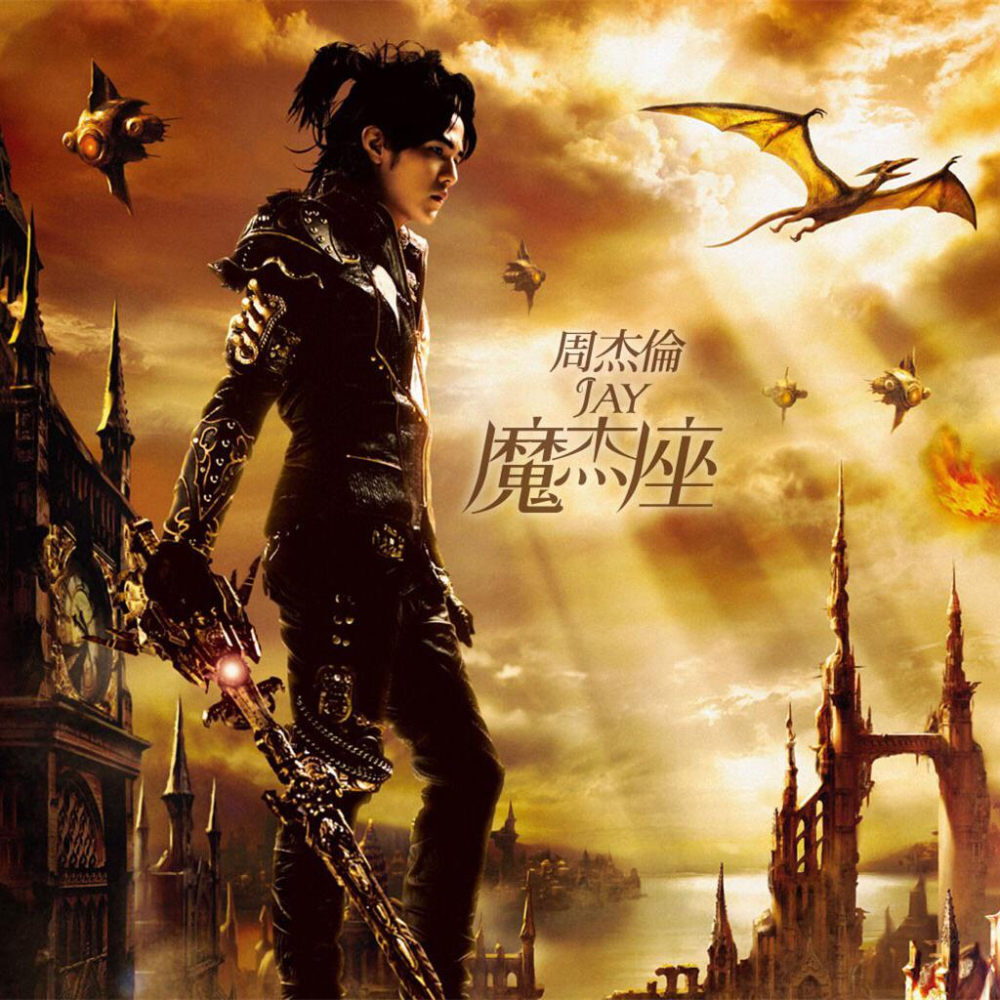

<link href="../../css/style.css" rel="stylesheet" type="text/css" />

20.9.2，周三，34℃／27℃，多云。

> <i class="fa fa-music"></i> 周杰伦 - 稻香：童年的纸飞机 现在终于飞回我手里。

<link href="../../css/font-awesome.min.css" rel="stylesheet" type="text/css" />

<audio src="/storage/emulated/0/Music/The_1990s/周杰伦%20-%20稻香.flac" controls loop></audio>

对这个世界 如果你有太多的抱怨

跌倒了 就不敢继续往前走

为什么 人要这么的脆弱 堕落

请你打开电视看看

多少人为生命 在努力勇敢的走下去

我们是不是该知足

珍惜一切 就算没有拥有

还记得 你说家是唯一的城堡

随着稻香 河流继续奔跑

微微笑 小时候的梦我知道

不要哭 让萤火虫带着你逃跑

乡间的歌谣 永远的依靠

回家吧 回到最初的美好

不要这么容易 就想放弃

就像我说的

追不到的梦想 换个梦不就得了

为自己的人生鲜艳上色

先把爱涂上喜欢的颜色

笑一个吧 功成名就不是目的

让自己快乐快乐 这才叫做意义

童年的纸飞机

现在终于飞回我手里

所谓的那快乐

赤脚在田里追蜻蜓 追到累了

偷摘水果 被蜜蜂给叮到怕了

谁在偷笑呢

我靠着稻草人 吹着风 唱着歌 睡着了

哦 哦 午后吉它在虫鸣中更清脆

哦 哦 阳光洒在路上不怕心碎

珍惜一切 就算没有拥有

还记得 你说家是唯一的城堡

随着稻香 河流继续奔跑

微微笑 小时候的梦我知道

不要哭 让萤火虫带着你逃跑

乡间的歌谣 永远的依靠

回家吧 回到最初的美好

还记得 你说家是唯一的城堡

随着稻香 河流继续奔跑

微微笑 小时候的梦我知道

不要哭 让萤火虫带着你逃跑

乡间的歌谣 永远的依靠

回家吧 回到最初的美好

----

距离发行时间已经过去了一个时代，这首稻香就这样带着一代人的童年记忆渐渐远去；当一个世纪、几个世纪过去之后，不知那时的人们还有没有人会想起？传唱？

