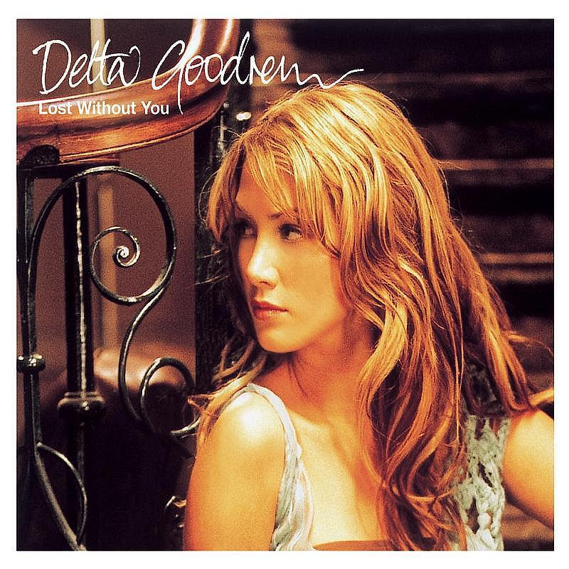

<link href="../../css/style.css" rel="stylesheet" type="text/css" />

<link href="../../css/font-awesome.min.css" rel="stylesheet" type="text/css" />

21.1.18，周一，17℃／8℃，晴转多云。

> <i class="fa fa-music"></i>：Delta Goodrem - Lost Without you

<audio src="/storage/emulated/0/Music/Pop/Lost Without you.m4a" controls loop></audio>

> Lyric

作曲 : Benenate, Gerrard

I know I can be a little stubborn sometimes 我知道我有时候会显得固执

You might say 如你所说

a little righteous and too proud 喜欢较真 过于骄傲

I just want to find a way to compromise 我只是想找一个妥协的方法

Cos I believe that we can work things out 因为我相信我们可以解决所有问题

I thought I had all the answers never giving in 我以为我有万千理由从不让步

But baby since you've gone 可是亲爱的自从你离开之后

I admit that I was wrong 我承认是我错了

All I know is I'm lost without you 我只知道我迷失在了没有你的日子里

I'm not gonna lie 我无法欺骗自己

How am I gonna be strong without you 没有你我要怎么继续坚强

I need you by my side 我需要你在我身边

If we ever said we'd never be together 曾经我们说过再也不会在一起

and we ended with goodbye 以分别结束我们的关系

Don't know what I'd do 我真的不知道我该怎么办

I'm lost without you 我迷失在了没有你的日子里

I keep trying to find my way 我努力寻找自己的方向

but all I know is I'm lost without you 却只发现没有你我已没有了方向

I keep trying to face the day 我试着面对接下来的日子

I'm lost without you 但没有你我迷失了自己

How am I ever gonna get rid of these blues 我该怎样才能摆脱这份悲伤

Baby I'm so lonely all the time 亲爱的我每时每刻都感到孤单

Everywhere I go I get so confused 不论走到哪里我都如此迷茫

You're the only thing that's on my mind 你是我脑海里唯一的牵挂

Oh my bed's so cold at night 长夜如此清冷

And I miss you more each day 我对你的思念与日俱增

Only you can make it right 只有你才能让我不再孤寂

No I'm not too proud to say 我不再羞于说出这句话

All I know is I'm lost without you 我只知道我迷失在了没有你的日子里

I'm not gonna lie 我无法欺骗自己

How am I gonna be strong without you 没有你我要怎么继续坚强

I need you by my side 我需要你在我身边

If we ever said we'd never be together 也许我们曾经说过再也不会在一起

and we ended with goodbye 以分别结束我们的关系

Don't know what I'd do 我真的不知道我该怎么办

I'm lost without you 我迷失在了没有你的日子里

I keep trying to find my way 我努力寻找自己的方向

but all I know is I'm lost without you 却只发现没有你我已没有了方向

I keep trying to face the day 我试着面对接下来的日子

I'm lost without you 但没有你我迷失了自己

If I could only hold you now 如今我只有拥抱你

Make the pain just go away 才能抹去所有的痛苦

Can't stop the tears from running down my face 泪水不停淌过我的脸颊

 (oh) (哦)

All I know is I'm lost without you 我只知道我迷失在了没有你的日子里

I'm not gonna lie 我无法欺骗自己

How am I gonna be strong without you 没有你我要怎么继续坚强

I need you by my side 我需要你在我身边

If we ever said we'd never be together 也许我们曾经说过再也不会在一起

and we ended with goodbye 以分别结束我们的关系

I don't know what I'd do 我真的不知道我该怎么办

I'm lost without you 我迷失在了没有你的日子里

I keep trying to find my way 我努力寻找自己的方向

but all I know is I'm lost without you 却只发现没有你我已没有了方向

I keep trying to face the day 我试着面对接下来的日子

but all I find is I'm lost without your love 却发现失去你的爱我不知所措

I keep trying to find my way 我努力寻找自己的方向

but all I know is I'm lost without you 却只发现没有你我已没有了方向

I'm lost without you 没有你我迷失了自己

<!--

<audio src="http://antiserver.kuwo.cn/anti.s?useless=/resource/&format=mp3&rid=MUSIC_61987781&response=res&type=convert_url&" controls></audio>

<audio src="http://m10.music.126.net/20210119230843/2edb96286291e029ff14c1d657bdebdc/ymusic/obj/w5zDlMODwrDDiGjCn8Ky/3058966625/c606/685a/a4d8/e480a986c9b6771cbc7198dda752483b.mp3" controls loop></audio>

-->

