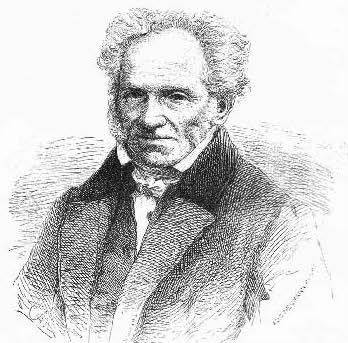

<link href="../../css/style.css" rel="stylesheet" type="text/css" />

# 序言

从第一次翻开叔本华的作品，我便决定尽可能多地阅读他的文字。叔本华一直是我非常喜欢的哲学家。这种感情不仅来自于他超于时代的哲学思想，他独特性格也是其中重要的原因。叔本华的著作在国内已经引进了很多部，以韦启昌先生和白冲石先生译本为多。在众位翻译大师严谨辛劳的翻译下，叔本华的大部分作品已经被国内读者所阅读和熟知。

为了让更多读者认识叔本华，走进他的哲学世界，汇总编辑一本叔本华作品箴言是很有必要的。可以说，这本《叔本华心灵咒语：请优雅地拥抱这个苦难的世界》正是一本现实版的叔本华作品集。本书既包括著名的《作为意志和表象的世界》中关于哲学本体论的通俗化介绍；也包括《人生的智慧》中“幸福论”的阐述；有《叔本华论道德与自由》中关于我们与大自然的本质及其作用规律的探讨；也有《叔本华思想随笔》《叔本华美学随笔》等作品中其对哲学、伦理学、心理学、性学、美学、教育学、玄学、宗教等多个方面的深刻思想……

我希望所有热爱叔本华，了解叔本华，对哲学感兴趣的读者都能够阅读这本书。它会给你带来一个全新的视角，领略到叔本华这位“不折不扣的天才”的思想魅力。

----

在阅读这本书之前，我希望读者能够对叔本华及他的理论思想有一个大概的了解。谨以此序作抛砖之用，希望更多的人能够读懂叔本华。正如奥地利小说家弗兰茨 ·卡夫卡所说，“叔本华是一个语言艺术家，仅仅因为他的语言，我们就应该无条件地阅读他的著作。 ”

叔本华于 1788 年 2 月 22 日，出生在德国一个商人家庭。父亲是非常成功的商人，后自杀，给叔本华留下了丰厚的遗产，因此叔本华一生过着富裕的生活。叔本华去世后，将所有财产捐给了慈善事业。叔本华的母亲是一位作家，与很多文豪都有交往。叔本华一直认为父亲的自杀是因为母亲的自私享乐，因此母子隔阂非常深。

1811 年，叔本华于柏林学习一段时间后，对哲学产生了浓厚的兴趣，并最终以《论充足理由律的四重根》获得了博士学位。歌德对此文非常欣赏，同时发现了叔本华的悲观主义倾向，告诫说，“如果你爱自己的价值，那就给世界更多的价值吧。 ”叔本华还是一位语言大师，他能够流利使用英语、意大利语、西班牙语等多种欧洲语言和拉丁语等古代语言。作为一个著名的悲观主义者，叔本华谈过恋爱；每天阅读伦敦《泰晤士报》；脾气火爆，曾把一女裁缝推下楼梯，因此需付终生补偿。在她过世时，叔本华写到：“老妇死，重负释”（obit anus，abit onus）。在叔本华的众多作品中，最著名且能代表他主要思想的应该是《作为意志和表象的世界》。

----

在 1814~1819 年间，叔本华在理智的孤独中完成了这部作品，但发表后无人问津。对此，叔本华如是说：“如果不是我配不上这个时代，那就是这个时代配不上我。 ”

在 1859 年，《作为意志和表象的世界》的第三版终于引起轰动，“全欧洲都知道这本书”了。他在第三版序言中写道，“当这本书第一版问世时，我才 30 岁，看到第三版时却不能早于 72 岁。总算，我在彼德拉克的的名言中找到了安慰：‘走了一整天，傍晚走到了，那也该满足了。 ’”叔本华在最后的十年终于得到了声望。

叔本华是个涉猎广泛的美学家，他对音乐、绘画、诗歌和歌剧等都有研究。他把艺术看作是解除人类存在痛苦一个可能途径。

对于伦理学，他从人类行为的动机出发探讨人类道德的基础。叔本华认为人类行为的动机可以分成三种：希望自己快乐，希望他人痛苦，希望别人快乐。他分别概括为：利己、恶毒、同情。

叔本华的悲观主义有时被解释为受家庭环境因素而造成的。他的父亲易怒而忧郁，他的母亲自私而冷漠。从哲学意义上说，叔本华认为人们总是试图满足欲望，但这种满足却更加证明了意志本身，这被叔本华认为是世界上最悲哀的事情。他认为人只有在摆脱一种强烈的欲望的时候才能获得根本的自由，只有打破意志对于行为本身的控制，才能获得幸福的可能。

----

作为悲观主义哲学家，叔本华并不赞同自杀，他认为自杀行为正是肯定了意志本身的显现。

对于教育，叔本华认为孩子们往往先被灌输许多不曾接触过的概念，只有在他们成年后才能接触到直观知识，这导致了人们的判断力直到很晚才成熟起来。他认为学习时应该遵循直观知识先于概念知识的顺序。

1860 年，9 月 21 日，他起床洗完冷水浴之后，像往常一样独自吃早餐，当佣人再次进来时，发现他已依靠在沙发的一角，永远地睡着了。

叔本华的悲观主义、形而上学和美学影响了哲学、艺术和心理学等诸多方面。

受到叔本华影响的人们：

尼采、萨特、弗洛伊德、荣格、托尔斯泰、莫泊桑、萧伯纳、马勒、爱因斯坦、薛定谔、达尔文……

尼采作《作为教育家的叔本华》来纪念他

瓦格纳把歌剧《尼伯龙根的指环》献给叔本华

莫泊桑称他为“人类历史上最伟大的梦想破坏者”

国学大师王国维在《人间词话》中以叔本华的理论评宋词

……

