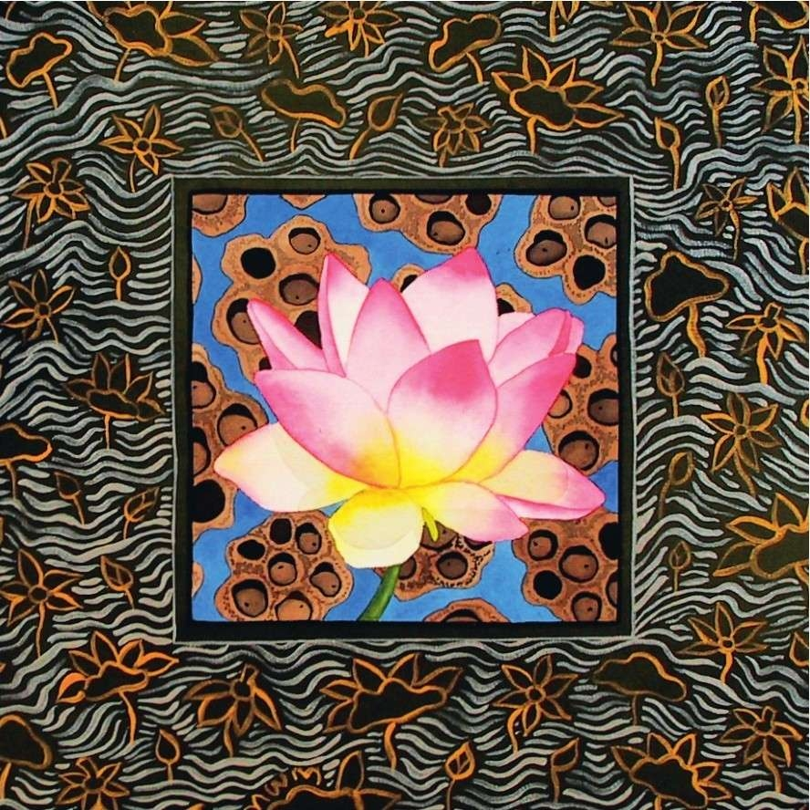

<link href="../css/style.css" rel="stylesheet" type="text/css" />

# 泰戈尔：吉檀迦利

## 4

Life of my life,I shall ever try to keep my body pure, knowing that thy living touch is upon all my limbs.

I shall ever try to keep all untruths out from my thoughts, knowing that thou art that truth which has kindled the light of reason in my mind.

I shall ever try to drive all evils away from my heart and keep my love in flower, knowing that thou hast thy seat in the inmost shrine of my heart.

And it shall be my endeavour to reveal thee in my actions, knowing it is thy power gives me strength to act.

我生命中的生命，我要不断努力保持身体洁净，因为我知道你生之爱抚正触及我的四肢。

我要不断努力使思想远离虚伪，因为我知道你是那点燃我心中理性之火的真理。

我要不断努力驱除心中一切邪恶，让我的爱之花常开，因为我知道，你已在我内心圣殿深处安放了座位。

我要竭力在我的行为中展现你，因为我知道，是你的神力给了我行动的力量。

