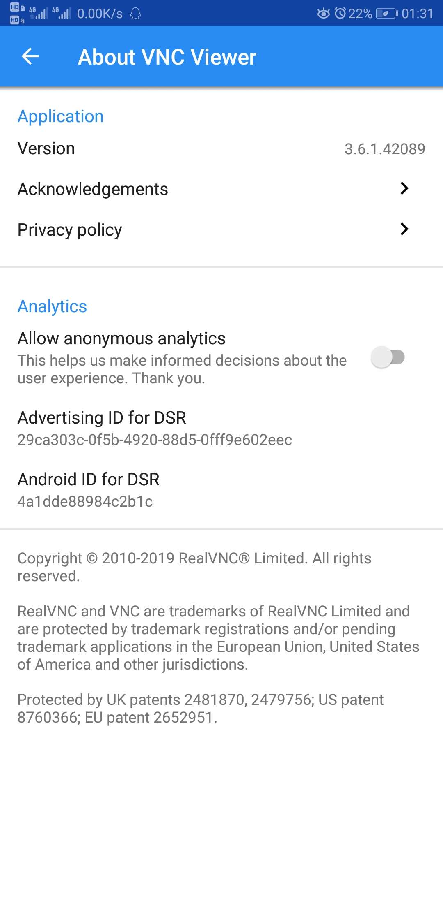
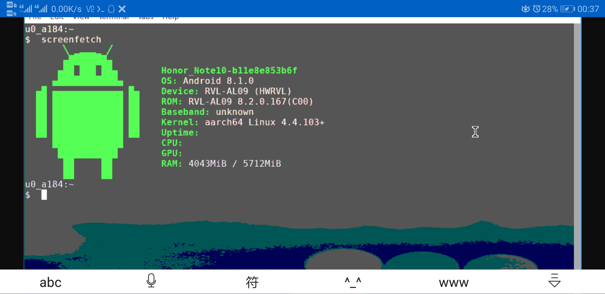
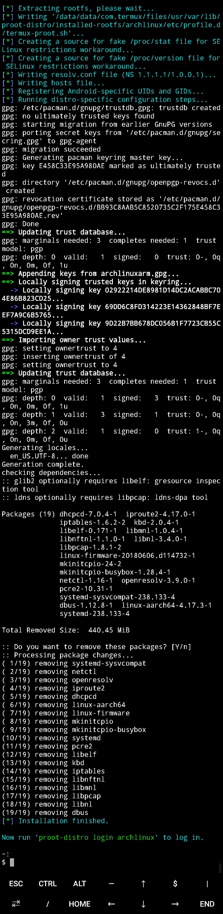
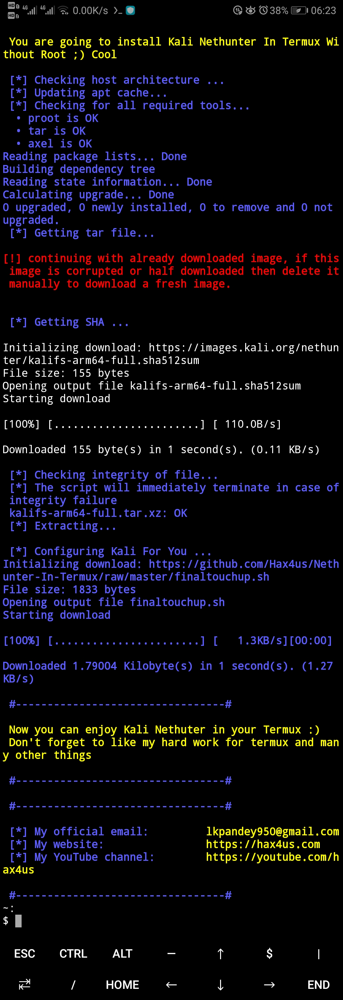

<link href="../css/style.css" rel="stylesheet" type="text/css" />

# Termux 笔记

<div class="p">

[Termux][termux][^termux] 是一款运行在 Android 设备上带有软件包管理的终端模拟器。从 F-Droid 或者 GitHub 以及酷安和谷歌商店上可以获得。

</div>

## 安装、配置 Termux

> 换源：

- [清华大学开源软件镜像站][tuna]
- [中科大 USTC Mirror Help][ustc]

[tuna]: https://mirrors.tuna.tsinghua.edu.cn/
[ustc]: http://mirrors.ustc.edu.cn/help/termux.html 

> termux config list: 

+ [$PREFIX/usr/etc/apt/source.list](../back/termux/source.list)
+ [termux.propertions](../back/termux/.termux/termux.propertions)
+ [.bashrc](../back/termux/.bashrc)

```bash
pkg install root-repo
pkg update
pkg upgrade
```

> 参考：

- [Termux wiki 页][termux_wiki]
- [配置 Termux][termux_config]
- [国光的 Termux 高级终端安装使用配置教程博客页][sqlsec]

<div STYLE="page-break-after: always;"></div>

## 使用 vnc 客户端运行图形界面，具体操作见[Termux 运行图形界面][termux_ge]

+ 首先需要在 termux 上安装 vnc 服务端`tigervnc`，在 Android 宿主机上安装客户端：vnc viewer 或者其它的。

+ 接下来在 termux 上尝试运行服务端并进行服务端初次运行时的一些必要性的配置，并在宿主机上启动 vnc 客户端软件尝试配置连接[^xsdl]。

```bash
#run vncserver
vncserver -localhost
export DISPLAY=":1"

#kill vncserver
vncserver -kill :1
```

<div STYLE="page-break-after: always;"></div>



> 因为 vncserver 在初始化时设置了密码，所以在运行 vnc 客户端初次连接时也会进行密码询问。



<div STYLE="page-break-after: always;"></div>

## ` Termux `安装` Arch Linux `的` arrch `版（不需要` root `）


<div class="p">

简单一点的方式[^run]是使用 proot-distro 提供的一组脚本。具体参考：[Termux 高级终端安装使用配置教程][sqlsec] 和  [Termux Proot distro](https://github.com/termux/proot-distro)。**root 方案可参考**：[Linux Deploy](#linuxdeploy)。

</div>

[^run]: 还支持 Unbutu，Slackware，Kali Nethurter 等系统的 arm 版。

    虽然这不需要太多运行内存和存储空间，不过为了能够顺利的在安卓设备上运行，至少应该确保设备满足基本的 Linux 运行环境。


> 首先安装 proot-distro：

```bash
pkg install proot-distro
#或者手动下载安装：
wget https://codeload.github.com/termux/proot-distro/zip/master.zip
unzip proot-distro.zip

git clone https://codeload.github.com/termux/proot-distro.git
cd proot-distro
./install.sh
```

+ 安装[^install]系统[^err]：`proot-distro install archlinux`

+ 进入系统：`proot-distro login archlinux`

[^install]: 卸载｜移除：`proot-distro uninstall archlinux`

[^err]: 如果下载 rootfs 一直失败，可以尝试从
[ustc][ustc_arm] [eu][eu] 手动获取：ArchLinuxARM-aarch64-latest.tar.gz 然后放到 `$PREFIX/usr/var/lib/proot-distro/dl...`下，并重复这个安装指令。

[ustc_arm]: http://mirrors.ustc.edu.cn/archlinuxarm/os/ArchLinuxARM-aarch64-latest.tar.gz

[eu]: https://eu.mirror.archlinuxarm.org/os/ArchLinuxARM-aarch64-latest.tar.gz


> 进入系统后的一些非必要调整[^调整]：

```bash
pacman -Rnc  dbus linux-aarch64 systemd linux-firmware
```

[^调整]: 这不是必须要做的。如果在安装过程中安装脚本并没有帮忙移除掉这些，可以选择手动移除，因为其中包含的一部分模拟固件和设备驱动在 Termux 的 chroot 环境不可用。

> /etc/pacman.d/mirrorlist

```config
#China ustc
Server = https://mirrors.ustc.edu.cn/archlinuxarm/$arch/$repo
#tuna 
Server = http://mirrors.tuna.tsinghua.edu.cn/archlinuxcn/$arch
```
[tuna]: https://mirrors.tuna.tsinghua.edu.cn/archlinux/iso/2020.11.01/

<div STYLE="page-break-after: always;"></div>

> `proot-distro install archlinux` log: 

<div>



</div>

<div STYLE="page-break-after: always;"></div>

> Kali Linux for Android （aarch64）



<div STYLE="page-break-after: always;"></div>

# [Linux Deploy][][^deploy]

> <a id="linuxdeploy">Linux Deploy</a>。

<div STYLE="page-break-after: always;"></div>

[^deploy]: [Linux Deploy][] 可以让 Android 设备运行 Linux（不仅仅是 Arm 版，还可以是 PC 端上的架构，但这需要 Android 设备获取 root，同时需要 [busybox for Android](https://github.com/meefik/busybox)）。

    当然，root Android 设备后，Linux Deploy 不是唯一的 Android 设备运行 Linux 方案，类似的还有 Linux On Android 项目。

[Linux Deploy]: https://github.com/meefik/linuxdeploy


[termux_wiki]: https://wiki.termux.com/wiki/Main_Page
[h_board]: https://wiki.termux.com/wiki/Hardware_Keyboard
[external_storage]: https://wiki.termux.com/wiki/Internal_and_external_storage
[termux_config]: https://wiki.termux.com/wiki/Terminal_Settings
[termux_ge]: https://wiki.termux.com/wiki/Graphical_Environment

[^termux]: 安装 Termux 并不需要 root 安卓设备，在 Termux 上运行 GNU/Linux 的 aarch 版本也不需要。除了以上功能，它还可以配置数据库以及基本的开发环境（C，c++，python……）。

    关于 [Termux][termux] 的详细配置中文讨论可以阅读国光的 [Termux 高级终端安装使用配置教程][sqlsec] 博客页，也可直接阅读 Termux 的[维基页][termux_wiki]以及 [AnLinux-wiki][]。不幸的是：迄今为止，Termux 依然不支持实体键盘选择中文键盘布局也即无法输入中文。

[termux]: https://termux.com/
[AnLinux-wiki]: https://github.com/EXALAB/AnLinux-App/wiki


[^xsdl]: 太慢。XSDL 应该也可以。虽然我觉得这一点都不酷。

[sqlsec]: https://www.sqlsec.com/2018/05/termux.html
