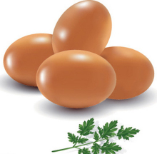
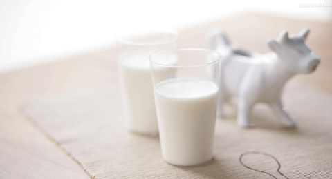

<link href="../../css/style.css" rel="stylesheet" type="text/css" />

&nbsp;&nbsp;&nbsp;&nbsp;部分内容出自香哈菜谱，大部分内容经网络整理排版所得。如有侵权，mailto: <a href="mailto: k_y_z_s@yeah.net"> k_y_z_s</a>，立删。

## 鸡蛋 [^egg][^鸡蛋]：

[^egg]: 鸡蛋，又名鸡卵、鸡子，是母鸡所产的卵。其外有一层硬壳，内则有气室、卵白及卵黄部分。富含胆固醇，营养丰富。一个鸡蛋重约50克，含蛋白质7-8克，脂肪5-6克。鸡蛋蛋白质的氨基酸比例很适合人体生理需要、易为机体吸收，利用率高达98%以上，营养价值很高，是人类常食用的食物之一。含有很高的蛋白质。

[^鸡蛋]: 鸡蛋味甘；性平。归肺；脾；胃经。滋阴润燥；养血发胎。主热病烦闷；燥咳声哑；目赤咽痛；胎动不安；产后口渴；下痢；疟疾；烫伤；皮炎；虚人赢弱。

功效与作用：

- 健脑益智：鸡蛋对神经系统和身体发育有很大的作用，其中含的胆碱可改善各个年龄组的记忆力。

- 保护肝脏：鸡蛋中的蛋白质对肝脏组织损伤有修复作用，蛋黄中的卵磷脂可促进肝细胞的再生。还可提高人体血浆蛋白量，增强肌体的代谢功能和免疫功能。

- 防治动脉硬化：美国营养学家和医学工作者用鸡蛋来防治动脉粥样硬化，获得了出人意料惊人效果，他们从鸡蛋、核桃、猪肝中提取卵磷脂，每天给患心血管病人吃4～6汤匙。3个月后，患者的血清胆固醇显著下降，获得满意效果。

- 预防癌症：根据对全世界人类癌症死亡率进行的分析，人们发现癌症的死亡率与硒的摄入量成反比。而鸡蛋中含有丰富的硒元素。

- 延缓衰老：不少长寿老人的延年益寿经验之一，就是每天必食一个鸡蛋。

- 美容护肤：鸡蛋中还含有较丰富的铁，铁元素在人体起造血和在血中运输氧和营养物质的作用。人的颜面泛出红润之美，离不开铁元素。如果铁质不足可导致缺铁性贫血，使人的脸色萎黄，皮肤也失去了美的光泽。由此可见，鸡蛋确是维护皮肤美的重要食品之一。

**适宜人群：一般人群均可食用。尤适宜发育期婴幼儿。**

**禁忌人群：高热、腹泻、肝炎、肾炎、胆囊炎、冠心病患者忌食。**

营养价值

1.鸡蛋几乎含有人体必需的所有营养物质，如蛋白质、脂肪、卵黄素、卵磷脂、维生素和铁、钙、钾，被人们称作“理想的营养库”。

2.鸡蛋中含有的营养素对人而言，仅次于母乳。一个鸡蛋所含的热量，相当于半个苹果或半杯牛奶的热量，但是它还拥有8%的磷、4%的锌、4%的铁、12.6%的蛋白质、6%的维生素D、3%的维生素E、6%的维生素A、2%的维生素B、5%的维生素B2、4%的维生素B6。

> 评价：鸡蛋热量及营养与生鸡蛋基本相同，但熟鸡蛋中的营养物质被人体吸收利用效率更高。

选购

1. 蛋壳的感官鉴别：用眼睛观察蛋的外观形状、色泽、清洁程度。良质鲜蛋，蛋壳清洁、完整、无光泽，壳上有一层白霜，色泽鲜明。次质鲜蛋，蛋壳有裂纹、硌窝现象；蛋壳破损、蛋清外溢或壳外有轻度霉斑等。更次一些的鲜蛋，蛋壳发暗，壳表破碎且破口较大，蛋清大部分流出。劣质鲜蛋，蛋壳表面的粉霜脱落；壳色油亮，呈乌灰色或暗黑色，有油样浸出；有较多或较大的霉斑。
2. 手摸鉴别：即用手摸索蛋的表面是否粗糙，掂量蛋的轻重，把蛋放在手掌心上翻转等。良质鲜蛋蛋壳粗糙，重量适当。次质鲜蛋，蛋壳有裂纹、硌窝或破损，手摸有光滑感；更次一些的鲜蛋蛋壳破碎、蛋白流出。手掂重量轻；蛋拿在手掌上翻转时总是一面向下(贴壳蛋)。劣质鲜蛋手摸有光滑感，掂量时过轻或过重。
3. 耳听鉴别：把蛋拿在手上，轻轻抖动使蛋与蛋相互碰击，细听其声；或是手握摇动，听其声音。良质鲜蛋蛋与蛋相互碰击声音清脆，手握蛋摇动无声。次质鲜蛋蛋与蛋碰击发出哑声(裂纹蛋)，手摇动时内容物有流动感。劣质鲜蛋蛋与蛋相互碰击发出嘎嘎声(孵化蛋)、空空声(水花蛋)。手握蛋摇动时内容物是晃荡声。
4. 鼻嗅鉴别：即用嘴向蛋壳上轻轻哈一口热气，然后用鼻子嗅其气味。良质鲜蛋有轻微的生石灰味。次质鲜蛋有轻微的生石灰味或轻度霉味。劣质鲜蛋有霉味、酸味、臭味等不良气味。

存储

1. 鸡蛋存放前不要用水冲洗，防止破坏鸡蛋表面的保护膜。
2. 放鸡蛋时要大头朝上，使蛋黄上浮后贴在气室下面，防止微生物侵入蛋黄。
3.一般再20℃左右大概能放一周，如果放在冰箱里保存，最多保鲜半个月。

食用方法

1. 鸡蛋吃法多种多样，就营养的吸收和消化率来讲，煮蛋为100%，炒蛋为97%，嫩炸为98%，老炸为81.1%，开水、牛奶冲蛋为92.5%，生吃为30%～50%。由此来说，煮鸡蛋是最佳的吃法，但要注意细嚼慢咽，否则会影响吸收和消化。不过，对儿童来说，还是蒸蛋羹、蛋花汤最适合，因为这两种做法能使蛋白质松解，极易被儿童消化吸收。
2. 做炒鸡蛋时，将鸡蛋顺一个方向搅打，并加入少量水，可使鸡蛋更加鲜嫩。
3. 鸡蛋在形成过程中会带菌，未煮熟的鸡蛋不能将细菌杀死，容易引起腹泻。因此鸡蛋要经高温煮熟后再吃。但是也不要煮的过老，鸡蛋煮的时间过长，蛋黄表面会形成灰绿色硫化亚铁层，很难被人体吸收。
4. 茶叶蛋应少吃，因为茶叶中含酸化物质，与鸡蛋中的铁元素结合，会对胃起刺激作用，影响胃肠的消化功能。

热量表（每100克）

- 热量 144(大卡) 
- 蛋白质 13.3(克) 高
- 脂肪 8.8(克) 
- 碳水化合物 2.8(克) 低
- 胆固醇 585(毫克) 高
- 维生素A 234(微克) 
- 维生素B1 0.11(毫克) 低
- 维生素B2 0.27(毫克) 
- 烟酸 0.2(毫克) 低
- 泛酸 2.9(毫克) 高
- 生物素 20(微克) 高
- 维生素D 49(微克) 高
- 维生素E 1.84(毫克) 低
- 钙 56(毫克) 低
- 磷 130(毫克) 
- 钾 154(毫克) 低
- 钠 131.5(毫克) 
- 镁 10(毫克) 低
- 铁 2(毫克) 低
- 锌 1.1(毫克) 低
- 硒 14.34(微克) 
- 铜 0.15(毫克) 低
- 锰 0.04(毫克) 低

### 功效与作用相克/宜搭

不宜搭配

- 消炎片+鸡蛋：一起吃会中毒
- 茶+鸡蛋：影响人体对蛋白质的吸收和利用
- 豆奶+鸡蛋：一起吃会影响营养素的吸收
- 鹅+鸡蛋：损伤脾胃
- 豆浆+鸡蛋：鸡蛋中黏液性蛋白易和豆浆中的胰蛋白酶结合，产生一种不能被人体吸收的物质大大降低了人体对营养的吸收
- 菠萝+鸡蛋：鸡蛋中的蛋白质与菠萝中的果酸结合，易使蛋白质凝固，影响消化
- 鹅肉+鸡蛋：一起吃伤元气
- 雪莲果+鸡蛋：不利于蛋白质的吸收
- 红薯+鸡蛋：一起吃会腹痛
- 糖精+鸡蛋：糖精与生鸡蛋一起吃会引起中毒
- 甲鱼+鸡蛋：性咸平，孕妇及产后便秘者忌食
- 柿子+鸡蛋：腹泻、生结石
- 味精+鸡蛋：鸡蛋本身含有许多与味精成份相同的谷氨酸，所以炒鸡蛋时放味精，不仅不能增加鲜味，反而会破坏和掩盖鸡蛋的天然鲜味
- 兔肉+鸡蛋：易产生刺激肠胃道的物质而引起腹泻
- 茶叶+鸡蛋：茶叶中除生物碱外，还有酸性物质，这些化合物与鸡蛋中的铁元素结合，对胃有刺激作用，且不利于消化吸收

适宜搭配

- 鸡蛋+干贝：营养全面
- 鸡蛋+玉米：防止胆固醇过高
- 鸡蛋+生菜：滋阴润燥清热解毒
- 鸡蛋+黄豆：降低胆固醇
- 鸡蛋+百合：滋阴润燥清心安神
- 鸡蛋+韭菜：补肾行气
- 鸡蛋+菠菜：提高维生素B12的吸收
- 鸡蛋+苋菜：增强人体免疫力
- 鸡蛋+桂圆：补气养血
- 鸡蛋+荠菜：缓解眩晕头痛
- 鸡蛋+茼蒿：帮助充分吸收维生素A
- 鸡蛋+银鱼：增加蛋白质的吸收
- 鸡蛋+丝瓜：润肺补肾美肤
- 鸡蛋+桂圆肉：补气养血
- 鸡蛋+圆生菜：滋阴润燥清热解毒
- 鸡蛋+洋葱：提高人体对维生素c和维生素E的吸收率
- 鸡蛋+香椿：润滑肌肤
- 鸡蛋+紫菜：有利于营养素的吸收
- 鸡蛋+小米：体改蛋白质的吸收
- 鸡蛋+青椒：有利于维生素的吸收
- 鸡蛋+干辣椒：有利于维生素的吸收
- 鸡蛋+牡蛎：促进骨骼生长

## 牛奶

功效与作用：

1. 镇静安神
意大利科研人员研究发现，牛奶之所以具有镇静安神作用是因为含有一种可抑制神经兴奋的成分。阿瓦洛内建议，当你心烦意乱的时候，不妨去喝一大杯牛奶安安神。睡前喝一杯牛奶可促进睡眠。
2. 抑制肿瘤:牛奶和奶制品干酪中含有一种CLA的物质，能有效破坏人体内有致癌危险的自由基，并能迅速和细胞膜结合，使细胞处于防御制癌物质侵入的状态，从而起到防癌作用。而且牛奶中所含的钙能在人体肠道内有效破坏致癌物质，使其分解改变成非致癌物质，并排出体外。牛奶中所含的维生素A、维生素B2、维生素D等对胃癌和结肠癌都有一定的预防作用。
3. 促进幼儿大脑发育：乳是哺乳动物出生后赖以生存发育的唯一食物，它含有适合其幼子发育所必须的全部营养素。
4. 美容养颜:牛奶中的乳清对面部皱纹有消除作用，可使皮肤保持光滑滋润。
5. 全面补充营养
可使动脉血管在高压时保持稳定，减少中风风险；能大大提高大脑的工作效率；能增强骨骼和牙齿，减少骨骼萎缩病的发生；使伤口更快愈合。

- **适宜人群：一般人群均可食用。**
- **禁忌人群：缺铁性贫血、乳糖酸缺乏症、胆囊炎、胰腺炎患者忌食；脾胃虚寒作泻、痰湿积饮者慎食。**

营养价值

1. 牛奶所含的碳水化合物中最丰富的是乳糖，乳糖使钙易于被吸收。
2. 牛奶中含有品质很好的蛋白质，包括酪蛋白，少量的乳清蛋白，其生物学价值为85。牛奶中包括人体生长发育所需的全部氨基酸，是其他食物无法比拟的。
3. 牛奶的蛋白质和热量的比例很合理，能保证饮用者不至摄入”纯“热量。
4. 牛奶中的钙含量很容易被吸收，另外，磷、钾、镁等多种物质的搭配也十分合理。
5. 牛奶中所含有的脂肪溶点低，颗粒小，很容易被人体消化吸收，并其消化率达97%。

> 评价：蛋白质和钙含量较丰富的一种饮品，减肥时可选择低脂或脱脂牛奶，每天的建议量为250g。

选购

> 鉴别牛奶的新鲜度：

1. 感官鉴别：新鲜乳（消毒乳）呈乳白色或稍带微黄色，有新鲜牛乳固有的香味，无异味，呈均匀的流体，无沉淀，无凝结，无杂质，无异物，无粘稠现象。
2. 将奶滴入清水中，若化不开，则为新鲜牛奶；若化开，就不是新鲜牛奶。若是瓶装牛奶，只要在牛奶上部观察到稀薄现象或瓶底有沉淀的，则都不是新鲜。
3. 煮沸试验法：取约10ml乳样于试管中（或透明玻璃杯中），置沸水中5分钟观察，如有凝结或絮状物产生，则表示牛奶不新鲜或已变质。
4. 好牛奶，不挂杯:买来的牛奶(没有煮过或微波炉加热过的)迅速倒入干净的透明玻璃杯中，然后慢慢倾斜玻璃杯，如果有薄薄的奶膜留在杯子内壁，且不挂杯，容易用水冲下来，那就是原料新鲜的牛奶。这样的奶是在短时间内就送到加工厂，而且细菌总数很低。如果玻璃杯上的奶膜不均匀，甚至有肉眼可见的小颗粒挂在杯壁，且不易清洗，那就说明牛奶不够新鲜。

> 存储：冷藏。牛奶不宜在日光照射下保存，也不宜冰冻保存。

食用方法

煮牛奶时不要加糖，须待煮熟离火后再加；加热时不要煮沸，也不要久煮，否则会破坏营养素，影响人体吸收；科学的方法是用旺火煮奶，奶将要开时马上离火，然后再加热，如此反复3～4次，既能保持牛奶的养分，又能有效地杀死奶中的细菌。

 热量表（每100克）

- 热量 54(大卡) 
- 蛋白质 3(克) 低
- 脂肪 3.2(克) 
- 碳水化合物 3.4(克) 低
- 胆固醇 15(毫克) 低
- 维生素A 24(微克) 低
- 维生素B1 0.03(毫克) 低
- 维生素B2 0.14(毫克) 低
- 烟酸 0.1(毫克) 低
- 维生素C 1(毫克) 低
- 维生素E 0.21(毫克) 低
- 钙 104(毫克) 低
- 磷 73(毫克) 低
- 钾 109(毫克) 低
- 钠 37.2(毫克) 低
- 镁 11(毫克) 低
- 铁 0.3(毫克) 低
- 锌 0.42(毫克) 低
- 硒 1.94(微克) 低
- 铜 0.02(毫克) 低
- 锰 0.03(毫克) 低

### 功效与作用相克/宜搭

不宜搭配

- 橙+牛奶：影响消化
- 酒+牛奶：导致脂肪肝，增加有毒物质的形成，降低奶类的营养价值，有害健康
- 西兰花+牛奶：影响钙的吸收
- 菜花+牛奶：牛奶含丰富的钙质，菜花所含的化学成份影响钙的消化吸收
- 雪莲果+牛奶：不利于蛋白质的吸收
- 番茄酱+牛奶：降低营养素的吸收率
- 香椿+牛奶：腹胀
- 空心菜+牛奶：影响钙质的吸收
- 果汁+牛奶：牛奶含有丰富的蛋白质，果汁属于酸性饮料，在胃中能使蛋白质凝结成块，影响吸收，从而降低牛奶的营养价值
- 橘子+牛奶：引起胃炎或胃蠕动异常
- 菠萝+牛奶：身体不适
- 韭菜+牛奶：牛奶中含钙；钙是构成骨骼和牙齿的主要成份；牛奶与含草酸多的韭菜混合食用,就会影响钙的吸收
- 菠菜+牛奶：一起吃会引起痢疾
- 红枣+牛奶：影响蛋白质的吸收
- 金针菇+牛奶：消化不良
- 猕猴桃+牛奶：影响消化吸收，出现腹胀、腹痛、腹泻
- 米汤+牛奶：导致维生素A大量损失
- 钙粉+牛奶：牛奶中的蛋白和钙结合发生沉淀，不易吸收
- 红糖+牛奶：使牛奶的营养价值大大降低
- 巧克力+牛奶：这两者一起吃易结成不溶性草酸钙，不仅影响吸收，还会出现头发干枯、腹泻、缺钙和生长发育缓慢等现象
- 乌鳢+牛奶：一起吃会引起中毒，可以用绿豆治疗
- 醋+牛奶：一起吃会引起腹中病结，可以用地浆水治疗
- 糖+牛奶：牛奶在加热时能与果糖反应，产生有毒的果糖氨基酸，有害人体

> 适宜搭配

- 牛奶+香蕉：提高维生素B12的吸收
- 牛奶+蜂蜜：缓解贫血和痛经
- 牛奶+草莓：有助于维生素B12的吸收
- 牛奶+木瓜：美容养颜
- 牛奶+黑豆：帮助人体更好地吸收牛奶中的维生素B12
- 牛奶+桃：滋养皮肤

## 羊奶

## 驼奶

## 蜂蜜
