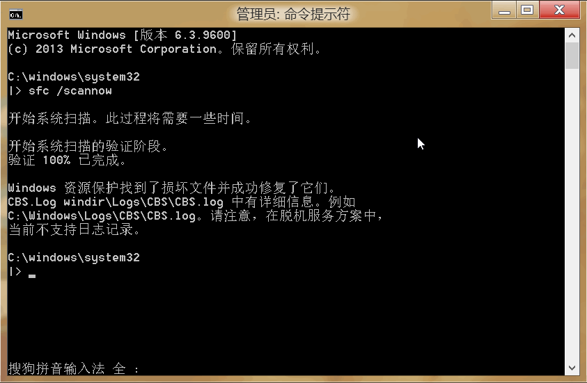

<link href="../css/style.css" rel="stylesheet" type="text/css" />

# Windows 8 笔记

+ [Windows 8.1 Optimization Tools](windows_tools.md)
+ [windows控制台命令笔记 :) :(](windows_cmd.md)
+ [注册表笔记](regedit.md)

> 一点心得：

+ [Windows 8.1 启用 .NET Framework 组件](Windows8.1启用.NET3.0和4.0组件.md)
+ [解决Windows 8.1 在雾面屏上字体渲染模糊的问题](win_font.md)
+ [让windows资源管理器消失的pdf缩略图重新显示出来](让windows资源管理器消失的pdf缩略图重新显示出来.md)
+ [Windows使用过程中遇到的一些问题](Windows使用过程中遇到的一些问题.md)
+ [Windows上连接网络遇到的问题](Windows上连接网络遇到的问题.md)

# 附

+ [bootice：分区切换工具](bootice.md)
+ [Firefox：一个免费的高自定义(扩展很多)浏览器的扩展小配置](firefox.md)
+ [Windows Applications List](programfiles.md)

## 在 Windows 8.1 上启用 .NET Framework 组件[^.net]

**如果计算机无法连接到网络，或者`Windows更新服务`不好使，我们可以直接使用 win8.1 的安装媒体（光盘，U 盘，iso 镜像）启用[^method] .NET 组件：首先挂载 iso 镜像，然后`以管理员权限运行命令提示符`使用 `Windows 部署工具：dism` 进行部署。**

[^.net]: `.NET Framework` 框架是 windows 上一组很重要的组件或者说运行时环境（实际上，它为用它实现的程序提供了运行时需要的库），它提供了某些应用程序和游戏运行时支持，如果你在运行一个程序时收到了 `需要安装 .NET Framework...` 类似的警告和提示，那就表明你的系统中没有安装 Windows 的这个功能。为了启用 windows  .Net Framework. 组件，你需要在 Windows 的程序和功能组件中安装这些更新（当然，你同样可以选择从他们的官网下直接下载这个组件然后运行安装程序来安装）。不过启用 windows 功能和更新需要联网，因此请确保网络畅通。另外，某些刚出厂的win8系统已经默认开启....

[^method]: 你可以直接直接在开始菜单上用鼠标右键 (或者按住键盘上的 windows 徽标键不放的同时按下键盘上的 X 键）然后选择程序和功能 >> 启用或关闭windows 功能 >> 最后勾选上带有 .NET 字样的选项然后只需要耐心等待就行了。如果一切顺利的话，那么windows 更新将会要求重启系统完成更新。这需要连接到网络。~~***然而，操作系统自带的 .NET 组件实际上只能满足少部分程序的运行要求，很多程序以及旧版本的 .Net 组件和运行库常常需要到微软官网或者其它网站自行下载后安装到系统***~~。。。。

## 修复[^repier] windows 8: `sfc /scannow`



```cmd
REM:: 如果修复失败可以尝试一下 DISM 联机修复
DISM.exe /Online /Cleanup-image /Restorehealth

REM 挂载 Windows 系统镜像，然后使用镜像修复

REM Dism /Image:C:\offline /Cleanup-Image /RestoreHealth /Source:c:\test\mount\windows

REM DISM.exe /Online /Cleanup-Image /RestoreHealth /Source:h:\Windows /LimitAccess
```

+ [解决Windows 资源保护找到了损坏文件但无法修复问题](https://wangye.org/blog/archives/1081/)
+ [使用系统文件检查器工具修复丢失或损坏的系统文件](https://support.microsoft.com/zh-cn/help/929833/use-the-system-file-checker-tool-to-repair-missing-or-corrupted-system)
+ [Repair a Windows Image](http://technet.microsoft.com/zh-cn/library/hh824869.aspx)

> 参考：

+ [360个人图书馆 轻松解除网页防复制  老D](https://laod.cn/black-technology/360doc-copy.html)
+ [AutoHotkey 0级入门教程_让重复工作一键完成_善用佳软_新浪博客](http://blog.sina.com.cn/s/blog_46dac66f010005g7.html)
+ [CMD一键获取 所有连接过的WIFI密码  老D](https://laod.cn/black-technology/cmd-obtain-wifi-password.html)
+ [dos批处理文件中的变量小结_DOS_BAT_脚本之家](http://www.jb51.net/article/49196.htm)
+ [Google宣布攻破SHA-1加密，从此SHA-1不再安全！  老D](https://laod.cn/news/google-sha-1.html)
+ [GPT 分区详解 ](http://www.jinbuguo.com/storage/gpt.html)
+ [Re_ 崩溃到ntdll.dll的问题 - 高端调试 __ 论坛](http://advdbg.org/forums/5776/ShowPost.aspx)
+ [Windbg符号与源码 《第二篇》 - 逆心 - 博客园](http://www.cnblogs.com/kissdodog/p/3729396.html)
+ [WinDBG加载符号表的一点心得体会 - whatday的专栏 - 博客频道 - CSDN.NET](http://blog.csdn.net/whatday/article/details/7100292)
+ [Windows 10上使用Bash on Ubuntu_Linux新闻_Linux公社-Linux系统门户网站](http://www.linuxidc.com/Linux/2016-04/130016.htm)
+ [Windows平台SSH登录Linux并使用图形化界面_Linux教程_Linux公社-Linux系统门户网站](http://www.linuxidc.com/Linux/2011-09/42340.htm)
+ [Windows下vim方式操作软件+Gvim使用 - Augusdi的专栏 - 博客频道 - CSDN.NET](http://blog.csdn.net/augusdi/article/details/43970341)
+ [Winsxs文件夹内容怎么清理 Winsxs文件夹瘦身清理教程图解_电脑常识_电脑基础_脚本之家](http://www.jb51.net/diannaojichu/164281.html)
+ [关于GPT磁盘的分区表备份 - 系统应用交流 - 红联Linux论坛](http://www.linuxdiyf.com/bbs/thread-310996-1-1.html)
+ [【教程】教你解决“Windows 资源保护找到了损坏文件但无法修复其中某些文件”的问题 _ Cystc's Blog](http://www.cystc.org/?p=2827)
+ [解密虾米音乐下载地址  老D](https://laod.cn/free/xiami-music.html)
+ [拉黑证书 让你的电脑再也装不上某些软件！附证书大全  老D](https://laod.cn/black-technology/pull-the-black-certificate.html)
+ [老D博客换域名啦 _ 老D博客](https://laod.cn/journal/cn-or-org.html)
+ [让Win10蓝屏显示详细信息，解决蓝屏哭脸-- Win10之家 - Win10系统下载官网](http://www.62hx.com/zixun/1101.html)
+ [让Win8.1“这台电脑”回到Win7风格-PChome](http://article.pchome.net/content-1678993.html)
+ [如何删除右键菜单里的赘余项目_Windows 8_www.knowsky.com](http://www.knowsky.com/561217.html)
+ [使用7zip压解各种文件的常用命令  老D](https://laod.cn/tools/7zip-jieya-mingling.html)
+ 逝去的经典-Windows95简体中文完全版_软件下载_软件区 卡饭论坛 - 互助分享 - 大气谦和_
+ [手把手教你在VirtualBox中与主机共享文件夹（图文介绍）_其它系统_操作系统_脚本之家](http://www.jb51.net/os/other/514409.html)
+ [【详细图解】一步一步教你自定义博客园（cnblog）界面 - voidsky - 博客园](http://www.cnblogs.com/voidsky/p/5490220.html)
+ [自定义百度网盘分享密码 提取码 _ 老D博客](https://laod.cn/black-technology/baidu-wangpan-tiquma.html)
+ Markdown 语法说明(简体中文版)
+ 学电脑应该先学习什么？_百度知道
+ 原创 不花钱！！自己动手，笔记本液晶屏屏线维修全程分享（图） 15步搞定 申精_电脑综合论坛
+ 在windows平台编译monodevelop - 夏雪的日志 - 网易博客
+ 如何拆装笔记本显示器_百度经验
+ 宏基V3-572g成功安装黑苹果10_10懒人版-远景论坛-微软极客社区
+ 宏碁v3 572g换高清屏_笔记本吧_百度贴吧
+ 笔记本电脑排线怎么拆 笔记本各种排线的拆卸教程_笔记本_硬件教程_脚本之家
+ 经典怀旧：VirtualBox安装Win95 - 详细图片展示 - 银河军团的日志 - 网易博客
- [1_4804591.doc](#)
- [AutoHotkey 0级入门教程_让重复工作一键完成_善用佳软_新浪博客](#)
- [file.txt](#)
- [GPT 分区详解 [金步国]](#)
- [GPT分区表详解.docx](#)
- [jQuery Ajax异步处理Json数据详解_jquery_脚本之家](#)
- [jQuery使用$.each遍历json数组的简单实现方法_jquery_脚本之家](#)
- [MyEclipse的下载地址.txt](#)
- [Re_ 崩溃到ntdll.dll的问题 - 高端调试 __ 论坛](#)
- [WinDBG加载符号表的一点心得体会 - whatday的专栏 - 博客频道 - CSDN.NET](#)
- [Windbg符号与源码 《第二篇》 - 逆心 - 博客园](#)
- [Windows 10上使用Bash on Ubuntu_Linux新闻_Linux公社-Linux系统门户网站](#)
- [Windows下vim方式操作软件+Gvim使用 - Augusdi的专栏 - 博客频道 - CSDN.NET](#)
- [Windows平台SSH登录Linux并使用图形化界面_Linux教程_Linux公社-Linux系统门户网站](#)
- [Winsxs文件夹内容怎么清理 Winsxs文件夹瘦身清理教程图解_电脑常识_电脑基础_脚本之家](#)
- [xP系统DOS命令.doc](#)
- [【教程】教你解决“Windows 资源保护找到了损坏文件但无法修复其中某些文件”的问题 _ Cystc's Blog](#)
- [关于GPT磁盘的分区表备份 - 系统应用交流 - 红联Linux论坛](#)
- [原创 不花钱！！自己动手，笔记本液晶屏屏线维修全程分享（图） 15步搞定 申精_电脑综合论坛](#)
- [在 win7 - win8 下安装苹果系统 (懒人版) 【转】_y480吧_百度贴吧](#)
- [在windows平台编译monodevelop - 夏雪的日志 - 网易博客](#)
- [如何删除右键菜单里的赘余项目_Windows 8_www.knowsky.com](#)
- [如何拆装笔记本显示器_百度经验](#)
- [学电脑应该先学习什么？_百度知道](#)
- [宏基V3-572g成功安装黑苹果10_10懒人版-远景论坛-微软极客社区](#)
- [宏碁v3 572g换高清屏_笔记本吧_百度贴吧](#)
- [手把手教你在VirtualBox中与主机共享文件夹（图文介绍）_其它系统_操作系统_脚本之家.docx](#)
- [手把手教你在VirtualBox中与主机共享文件夹（图文介绍）_其它系统_操作系统_脚本之家](#)
- [桌面文档.txt](#)
- [笔记本电脑排线怎么拆 笔记本各种排线的拆卸教程_笔记本_硬件教程_脚本之家](#)
- [经典怀旧：VirtualBox安装Win95 - 详细图片展示 - 银河军团的日志 - 网易博客.docx](#)
- [经典怀旧：VirtualBox安装Win95 - 详细图片展示 - 银河军团的日志 - 网易博客](#)
- [让Win10蓝屏显示详细信息，解决蓝屏哭脸-- Win10之家 - Win10系统下载官网](#)
- [让Win8.1“这台电脑”回到Win7风格-PChome](#)
- [逝去的经典-Windows95简体中文完全版_软件下载_软件区 卡饭论坛 - 互助分享 - 大气谦和_](#)

[^repier]: 因为我的误操作导致了 Win8 Metro 界面的所有应用包括 Win8 设置都无法正常使用。

