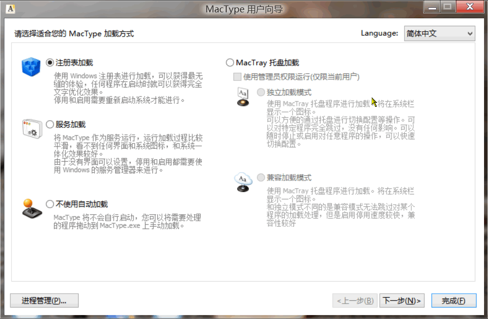

# Windows 8.1 的第三方字体渲染工具

***&nbsp;&nbsp;~~为了解决 Windows 8.1 在雾化屏上字体显示模糊的问题，我使用 Windows 8.1 自带的  `ClearType 渲染` 工具重新调整了字体渲染，但不幸的是：问题似乎并未就此解决。。。。为此，我只好使用了第三方字体渲染工具：`MacType` 来替代 Windows 8.1 自带的字体渲染工具[^1]。~~***

> **下面这是一张 MacType 的配置时截图：**

***&nbsp;&nbsp;~~如果你对 `MacType` 默认的字体方案不满意，还能定义自己的渲染方案。关于 MacType 字体渲染的具体细节，你可以从它的官网找到更多的信息。~~***
 
[^1]: **&nbsp;&nbsp;MacType 字体渲染方案有 5 种加载方式，当然以注册表的方式运行能获得媲美系统渲染工具一样好的渲染效果。并且，这种加载方式还是无缝的。不过，很遗憾，以注册表和服务方式加载的话就无法对其进行调整，要知道：某些应用程序是不可以用它进行字体渲染的，最严重的时候甚至会导致运行出错而没法调试。比如会让 Oracle VirtulaBox 创建虚拟机失败。**

[^2]: &nbsp;&nbsp;更不幸的是，一些版本旧一点的应用程序并不提供 windows 8.1 所谓的高分屏支持，在这种显示器上表现的很不友好，如此想要提升视觉上的体验，甚至还要适当调整显示器的默认缩放来适应这些应用程序！另外，一些旧版本的程序要想版本较新的 windows(比如 win 8)运行，还要对兼容性设置进行调整才能使应用程序正常工作外带显示正常。应用程序或者其快捷方式 -> 右键 -> 属性 -> 兼容性选项卡-> 勾选高 DPI 设置时禁用显示缩放。

[^3]:  比如要将默认缩放 125% 调整到 130%，方法是：桌面右键 -> 个性化 -> 显示 -> 自定义大小选项并勾选让我选择一个适合我的所有显示器的缩放级别 ；对于那些没有提供更改软件界面字体的程序，还要调整默认的应用程序菜单等字体大小。方法如上：仅更改文本大小 -> 菜单..... -> 然后点击应用 
